# Angular 9 - Partie 1 : Découverte de Angular - Cours
> - [Retourner à la liste des cours](../readme.md)
> - Exercices : [cliquez-ici](exercices.md)
> - Corrections : [cliquez-ici](corrections.md)

- [Angular 9 - Partie 1 : Découverte de Angular - Cours](#angular-9---partie-1--d%c3%a9couverte-de-angular---cours)
  - [1. Vue d'ensemble](#1-vue-densemble)
    - [Présentation de Angular](#pr%c3%a9sentation-de-angular)
    - [Pourquoi Angular ?](#pourquoi-angular)
    - [Euh, Typescript ?](#euh-typescript)
  - [Les outils nécessaires](#les-outils-n%c3%a9cessaires)
    - [Node.js](#nodejs)
    - [NPM](#npm)
    - [Installation](#installation)
  - [Notre première application Angular](#notre-premi%c3%a8re-application-angular)
  - [Notre premier projet !](#notre-premier-projet)
    - [Installer une première dépendance](#installer-une-premi%c3%a8re-d%c3%a9pendance)
      - [Euh, mais ça s'installe où tout ça ?](#euh-mais-%c3%a7a-sinstalle-o%c3%b9-tout-%c3%a7a)
    - [Déclarer Bootstrap dans le projet](#d%c3%a9clarer-bootstrap-dans-le-projet)
    - [Lancer notre projet Angular](#lancer-notre-projet-angular)
    - [Exercice](#exercice)
  - [> Supprimez tout (oui, tout !) le contenu de ce fichier et écrivez un simple `<h1>Hello World</h1>`. Actualisez... Euh non, n'actualisez pas : la page devrait s'actualiser toute seule à chaque sauvegarde de fichier !](#blockquote-supprimez-tout-oui-tout--le-contenu-de-ce-fichier-et-%c3%a9crivez-un-simple-h1hello-worldh1-actualisez-euh-non-nactualisez-pas--la-page-devrait-sactualiser-toute-seule-%c3%a0-chaque-sauvegarde-de-fichier--blockquote)
  - [Notre premier component](#notre-premier-component)

> Angular est un framework Javascript qui permet de composer des applications web de type SPA (Single Page Application). 

> Nous allons voir les concepts clés et tout ce que vous avez besoin de savoir  pour construire votre première application Angular.

## 1. Vue d'ensemble

### Présentation de Angular

Jusqu'à présent, vous savez développer un site en HTML/CSS et en Javascript. Depuis les débuts du web, des technologies sont venues en surcouche à ces trois langages de base pour rendre les pages plus accessibles, dynamiques, modernes.

Autour de 2005, la technologie AJAX est arrivée (Asynchronous Javascript And XML) qui permettait d'exécuter des requêtes HTTP (c'est à dire demander quelque chose à un serveur web) sans recharger la page ! Jusque alors, la seule manière que nous avions d'afficher un contenu différent dans une page, c'était de faire des liens en HTML vers une autre page contenant les nouvelles données.

Avec AJAX, on était alors capables de faire quelque chose de novateur : exécuter cette demande de nouveau contenu (donc, cette requête, qu'on appelle une requête HTTP), alors même que nous restions sur la même page !

Aujourd'hui les requêtes AJAX restent très utilisées. Par exemple sur Twitter: lorsque vous scrollez tout en bas de la page d'accueil, un évènement est déclanché en Javascript lorsque vous touchez le bas de la page, et la fonction déclanchée à ce moment dit quelque chose comme : "récupère-moi les tweets suivants et ajoute-les à la suite, dans le DOM". Et tout ça, sans recharger la page !

Il y aussi jQuery, qui est créé vers 2006 : en fait, jQuery n'ajoute pas vraiment de fonctionnalités (là où AJAX est une réelle nouvelle technologie), en fait, il nous permet d'utiliser ce que  Javascript nous permet déjà mais... plus facilement et de façon optimisée par rapport à ce que les navigateurs permettaient à l'époque !

On commence alors à savoir faire des sites web intéressants grâce à Javascript, qui auparavant était plutôt boudé des développeurs car peu optimisé et servant surtout à de l'apparât visuel plus qu'à des fonctionnalités réelles.

Arrive vers 2010 AngularJS, la première version de Angular, par Google. C'est enfin une boîte à outils complète, un framework, qui permet de développer des SPA (Single Page Applications), c'est à dire des applications web contenues sur une seule page dynamique. L'avantage d'utiliser un framework pour cela, c'est qu'il nous donne une série de conventions et une ligne de conduite à tenir pour coder et organiser notre projet.

À partir de la version 2, AngularJS (donc, la version 1), est renommée Angular. C'est une réécriture complète du framework pour le simplifier et l'optimiser grandement. Nous en sommes aujourd'hui à la version 9 !

### Pourquoi Angular ?

Depuis, de nombreux autres frameworks ont vu le jour : Angular, mais aussi React, Vue.js pour les plus utilisés.

> Tous ont leurs avantages et inconvénients, et comme souvent en programmation : **soyez agnostiques !** Choisissez vos outils en fonction de vos besoins, et ensuite en fonction de vos goûts.

- Angular est un framework très robuste, dont la courbe d'apprentissage peut effrayer. En fait, Angular est plus difficile à aborder de prime abord mais on se retrouve avec des compétences et des bonnes pratiques qui accélèrent nettement le développement de notre projet par la suite !

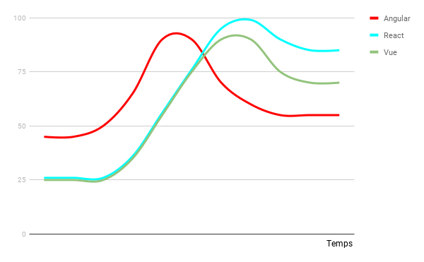

- Angular permet de bien structurer ses fonctionnalités (les composants) et possède un robuste ensemble d'outils prêts à l'emploi (un routeur, un moteur de template, du stockage local, une gestion des erreurs poussée...)

- React, de base, ne possède que la partie composants et templating. Il est pratique pour créer des composants isolés dans votre site.

- Vue est intéressant pour transformer une application web déjà existante, morceau par morceau, là où Angular est un projet complet dès le départ

- Angular utilise Typescript !

### Euh, Typescript ?

Typescript est à Javascript ce que SASS est à CSS : c'est un "sur-langage" qui sera transtypé, ou "traduit", en Javascript. Pourquoi l'utiliser ? Car l'un des reproches fait à Javascript est son côté très laxiste, permissif et peu cohérent dans sa structure, qui laisse passer trop facilement un code bugué ou mal optimisé. En fait, Typescript est un Javascript en très strict ! Il ne laisse passer aucune erreur (l'application ne fonctionnera simplement pas !), ce qui vous force à coder mieux et plus proprement... Pour au final, avoir un code mieux organisé et plus maintenable.

## Les outils nécessaires
Les frameworks Javascript utilisent Node et NPM pour gérer leurs dépendances, c'est à dire l'ensemble des outils nécessaires à leur fonctionnement.

### Node.js
Node.js est un serveur web (à l'opposé d'un client web qui demande des pages web, le serveur web distribue des pages web) écrit en Javascript. Bien que Angular soit bel et bien une technologie de front (donc, côté client), nous avons besoin de Node.js pour utiliser des outils de ligne de commande qui nous permettront de "compiler" notre code, c'est à dire transformer le code source en un code compréhensible par le navigateur web.

### NPM
NPM (Node Package Manager) est l'outil de gestions de dépendances de Node.js. Un gestionnaire de dépendances, c'est en fait un outil qui va lire la liste des dépendances de notre projet (par exemple: j'ai besoin d'un outil de traduction, de Boostrap, de telle et telle librairies...).

On peut consulter les packages (ou paquets, ou dépendances, ou libraries, ou bibliothèques) sur le site de NPM : https://www.npmjs.com/

L'avantage d'un gestionnaire de dépendances, c'est qu'avec quelques lignes de commandes, il maintiendra à jour toutes les dépendances du projet ! C'est nettement plus simple que d'avoir plein de lignes `script` ou `link` et de devoir vérifier pour chaque dépendance CSS ou JS s'il y a une mise à jour.

L'intérêt aussi est de "gérer les dépendances" : par exemple, j'ai besoin de la librairie DataTables pour rendre mes tableaux triables en Javascript. Cette dépendance a elle-même besoin de jQuery. Jusqu'à présent, je devais d'abord importer jQuery dans mon code puis importer DataTables pour que tout fonctionne.

Avec NPM, je peux simplement indiquer que j'ai besoin de DataTables pour qu'il s'occupe d'importer toutes les sous-dépendances !

> Exemple: allez jeter un oeil sur les dépendances du paquet [@angular/cli](https://www.npmjs.com/package/@angular/cli). En requérant ce package, il y a  20 autres dépendances qui s'installeront automatiquement et qui se maintiendront à jour toutes seules !

### Installation

- Téléchargez et installez la dernière version **LTS** de Angular : https://nodejs.org/en/download/
- Une fois installé, ouvrez un terminal et tapez `node -v` (comme "version") : si une version de Node s'affiche, c'est que tout fonctionne ! Sinon, il a probablement un bug.
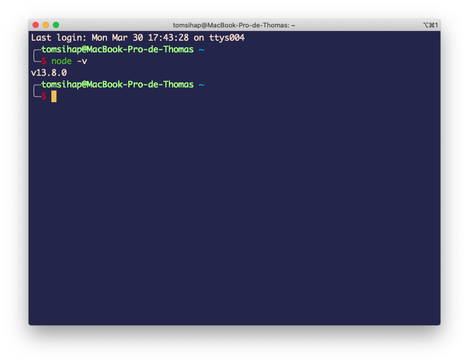

- Ensuite, saisissez `npm install -g npm@latest` pour installer la dernière version de NPM sur votre machine. Une fois l'installation terminée, vérifiez si la version apparaît avec `npm -v` :
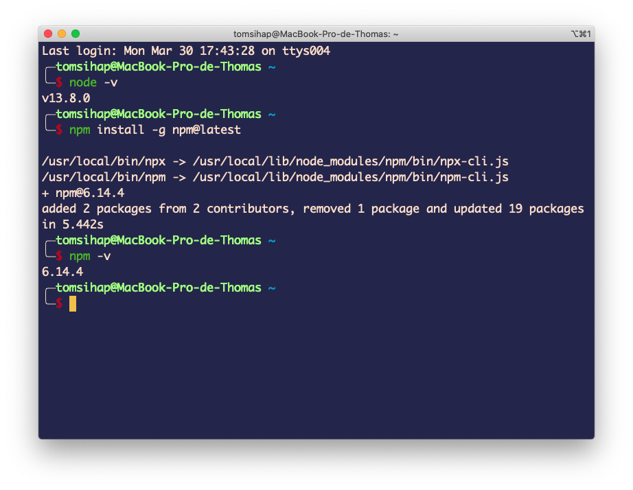

- Enfin, installez la ligne de commande de Angular sur votre machine avec : `npm install -g @angular/cli`

> - `npm`, c'est l'outil, le gestionnaire de package
> - `install`, c'est pour installer une dépendance
> - `-g`, c'est pour l'installer de partout dans la machine et non pas seulement dans le dossier actuel du terminal
> -`@angular`, c'est le développeur de la dépendance
> - `cli`, c'est le nom de la dépendance !

Une fois installé, vérifiez la version, cette fois avec... `ng version` (Pourquoi pas `-v` ? Aucune idée !)

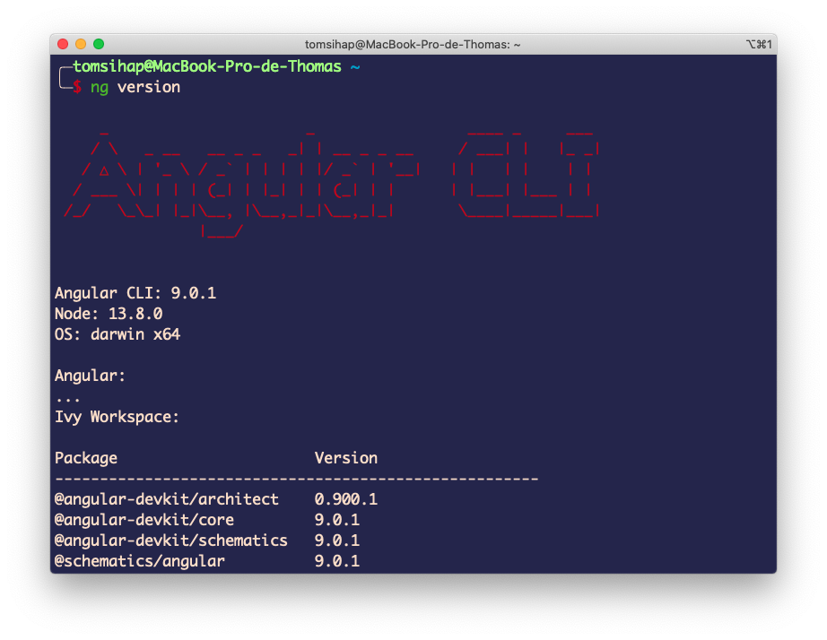

Ça y est, les outils sont prêts !

## Notre première application Angular

Pour commencer, créez un dossier dans lequel vous stockerez vos projets Angular. Il peut être n'importe où dans votre ordinateur, mais évitez de le mettre dans un dossier qui est géré par un drive (Dropbox, Google Drive, One Drive, iCloud...).

> En fait, on aura des dizaines de milliers de fichiers (hein, quoi ? Oui oui) qui vont s'installer pour gérer notre projet. Rappellez-vous le gestionnaire de dépendances ! Un paquet dépend de plusieurs autres, qui eux-même dépendent de plusieurs autres... et ainsi de suite !

> Mais alors, comment je sauvegarde ou partage mon projet du coup ? Ça, ça sera le rôle de Git !

Ouvrez maintenant ce dossier avec un terminal :
- Sous Windows, ouvrez le dossier en question puis cliquez dans la barre d'adresses du dossier. Dedans, saisissez `cmd` : un terminal s'ouvrira pile dans le bon dossier !

- Sous Mac, ouvrez `Terminal` puis naviguez jusqu'au dossier en question. Pour cela :
  - `ls` permet de visualiser le dossier en cours
  - `cd nomDuDossier` permet de rentrer dans le dossier `nomDuDossier`
  - `cd ..` permet de remonter d'un cran dans l'arobrescence de dossiers 
  - Par exemple, pour aller dans le dossier `projects` :
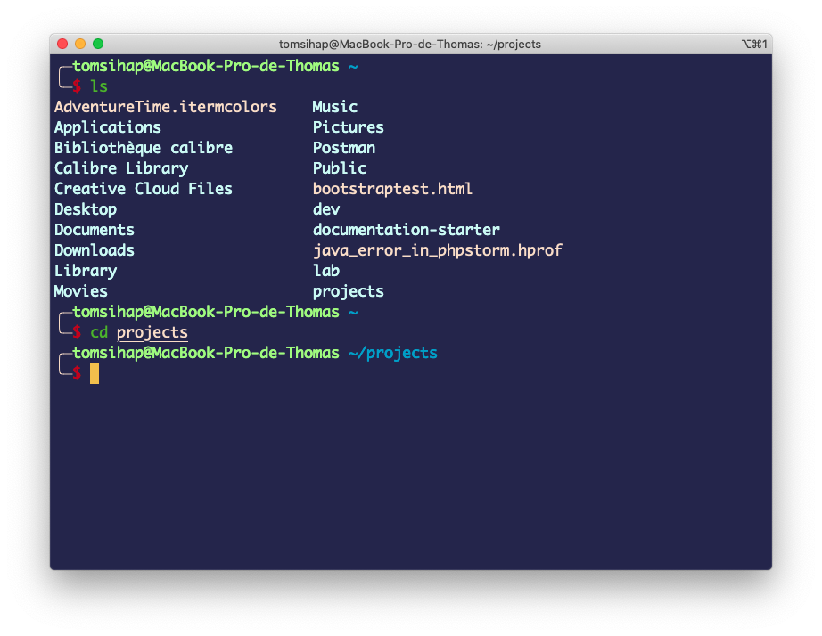

Ensuite, une fois dans ce dossier, saisissez la commande suivante :

`ng new firstProject --style=scss --skip-tests=true`
Puis saisissez `y` à la question posée.

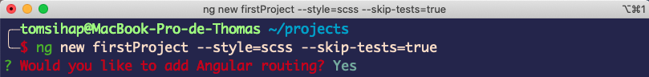

Un dossier `firstProject` contenant des tas de fichiers et dossiers va se créer ! Cela prend plus ou moins de temps la première fois.

Ici, on créée donc un projet grâce à `ng new` que l'on nomme `firstProject`. On ajoute des options facultatives qui nous permettent de préciser que nous utiliserons SASS pour les CSS et que nous ne souhaitons pas utiliser les tests unitaires de Angular (ce sont des fichiers où nous définissons un comportement de l'application afin de vérifier si ce comportement marche ou pas).

## Notre premier projet !

Ça y est, nous y sommes ! Notre premier projet Angular est maintenant créé. Vous allez maintenant l'ouvrir dans Visual Studio Code.

> **ATTENTION !** Faites extrêmement attention à ce qui va suivre. Promis, c'est facile ! Visual Studio Code ou tout autre IDE ne fonctionne bien que si, et seulement si, vous respectez la consigne suivante : vous devez **obligatoirement** ouvrir le dossier du projet dans lequel vous travaillez, dans VSCode !

Voici une fenêtre VSCode de base :
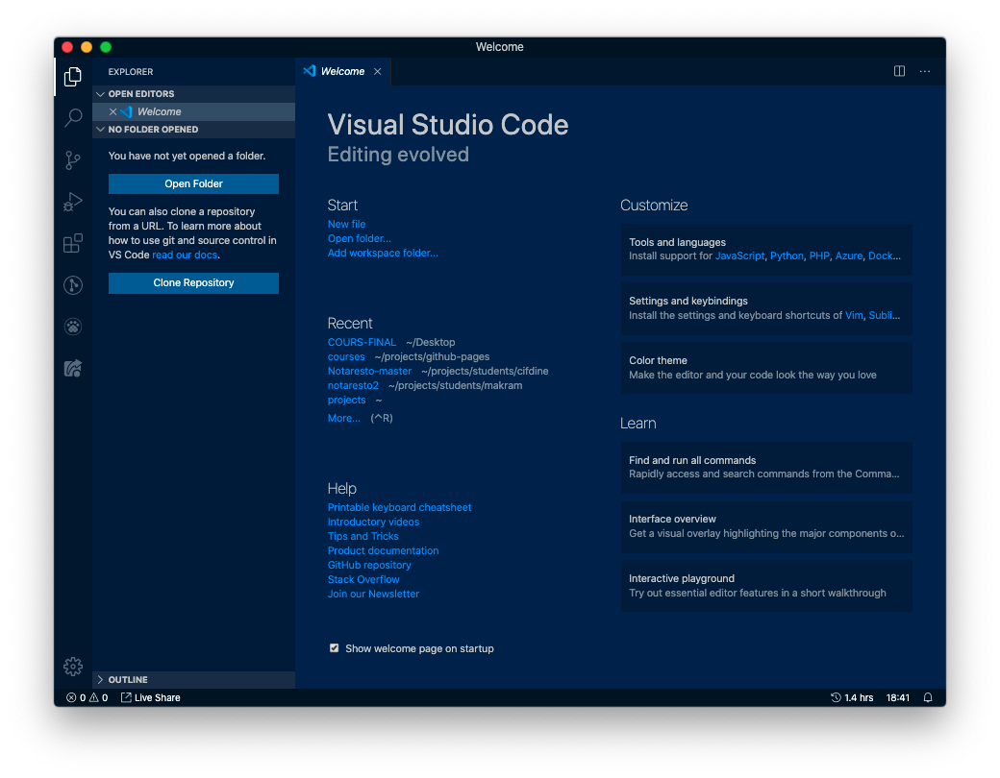

Cliquez sur `Open Folder` ou `Fichier > Ouvrir un dossier` ou `Files > Open Folder` afin d'ouvrir le dossier `firstProject`.

C'est vraiment très important, soyez vigilants ! Il ne faut pas ouvrir non plus un dossier en dessus (par exemple, s'il est stocké dans `C:\Mes Documents\cours\firstProject`, vous ne devez pas ouvrir `cours` mais bien `firstProject` !)

Pour être bien sûrs, vous devez avoir le dossier `firstProject` indiqué comme ci-dessous :


> Cette pratique est à respecter dorénavant pour tous le code que nous verrons ensemble à l'avenir, car nous travaillerons uniquement en mode "projet" et plus sur des fichiers isolés !

### Installer une première dépendance

Maintenant que votre VSCode est ouvert au bon endroit, vous pouvez ouvrir un terminal, cette fois directement dans VSCode. Vous pouvez aller dans `Terminal > New Terminal` (le raccourci clavier est indiqué sur le bouton, retenez-le car on va s'en servir très souvent 😉)

> Vous pouvez remarquer que le terminal est déjà ouvert au bon endroit, c'est un des avantages d'ouvrir le dossier du projet correctement !
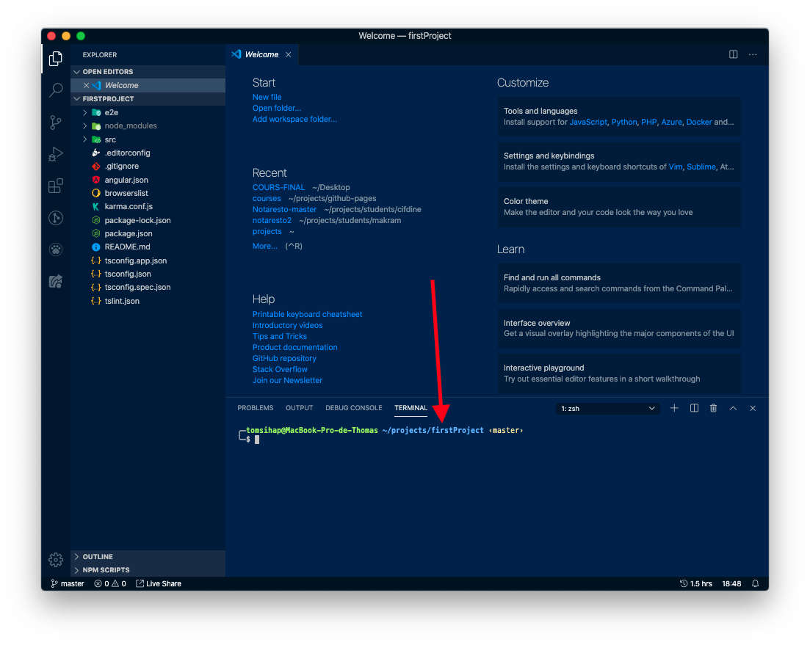

Indiquons dans le terminal que nous allons utiliser Boostrap :

```
npm i bootstrap
```

> Cette fois, pas de `-g` ! Je ne veux pas installer Boostrap sur toute ma machine (bien que Windows stylisé en Boostrap peut être... Euh, je m'égare là), mais uniquement dans le projet en cours, c'est à dire celui dont j'ai le dossier d'ouvert.

> Et cette fois, `i` plutôt que `install` ! C'est juste un raccourci.

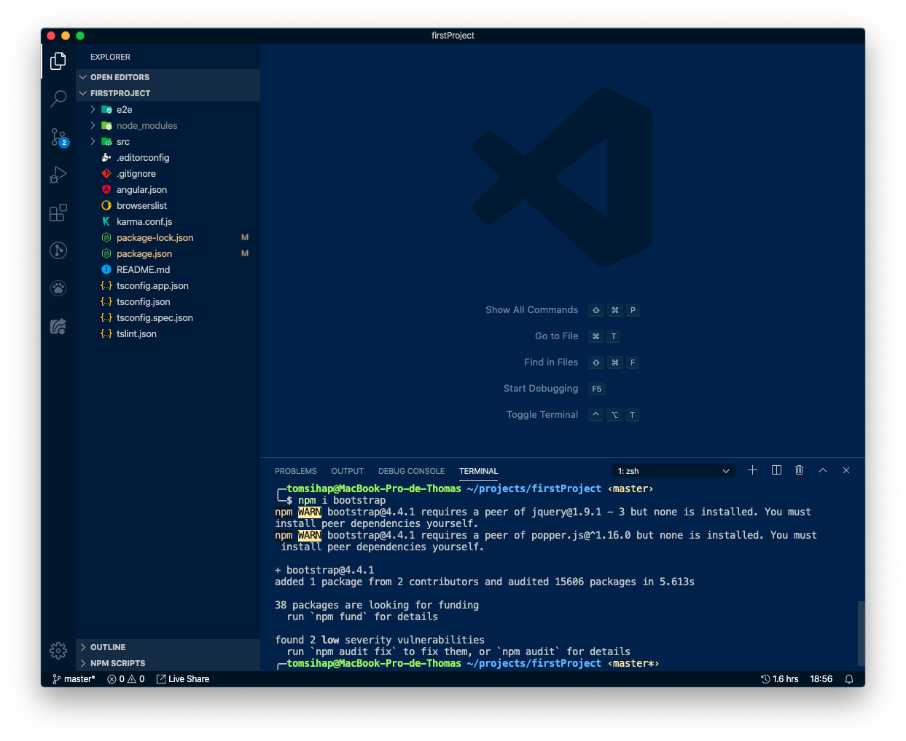

Jetez un oeil à `package.json` : ce fichier contient la liste des dépendances de notre projet. De base, Angular a besoin de beaucoup d'outils pour fonctionner ! En fouillant un peu, on peut voir notre nouvelle dépendance :

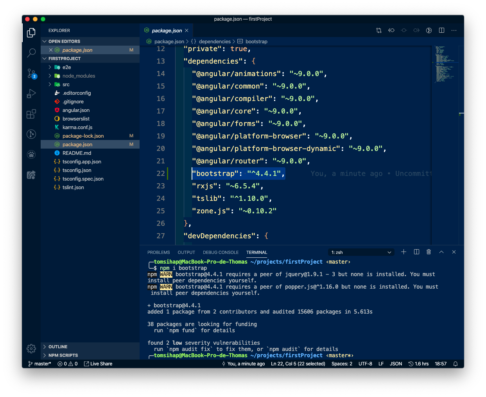

#### Euh, mais ça s'installe où tout ça ?

Parmi tous les fichiers et dossiers du projet, un dossier est grisé : c'est `node_modules`. C'est dans ce dossier que toutes les dépendances seront installées. **Il est interdit d'y toucher !** Vous ne pouvez pas modifier les fichiers qui s'y trouvent ! En fait, comme NPM gère toutes ces dépendances, en cas de mise à jour (et avec tous ces paquets, il en a beaucoup), il va simplement effacer vos modifications au profit de la version publique de la dépendance. Il existe d'autres manières de faire lorsque nous avons besoin de modifier une dépendance, mais ça viendra plus tard !

C'est aussi dans ce dossier où se trouvent plusieurs milliers de fichiers (61 000 pour l'instant !).

S'il est grisé, c'est que Git, qui est déjà présent dans le projet (`ng new` a fait ça seul !) ne le prévoit pas dans sa sauvegarde. En effet, on n'a pas du tout besoin de partager ce dossier `node_modules` ni de l'enregistrer où que ce soit quand on partage/sauvegarde le projet !

Pourquoi ?

Eh bien car nous avons `package.json` qui contient déjà la liste des dépendances ! Ainsi, il est bien plus simple de se partager le projet sans `node_modules` et de s'envoyer plutôt le projet avec `package.json`. Il suffira une fois le projet récupéré, de faire `npm install` dans le dossier du projet pour que NPM lise `package.json` et installe toutes les dépendances !

### Déclarer Bootstrap dans le projet

Pour que Angular prenne notre Bootstrap (installé dans node_modules donc) en style, modifiez le fichier `src/angular.json` et ajoutez modifiez le tableau `"styles"` en ajoutant la ligne suivante :

```
"node_modules/bootstrap/dist/css/bootstrap.min.css",
```

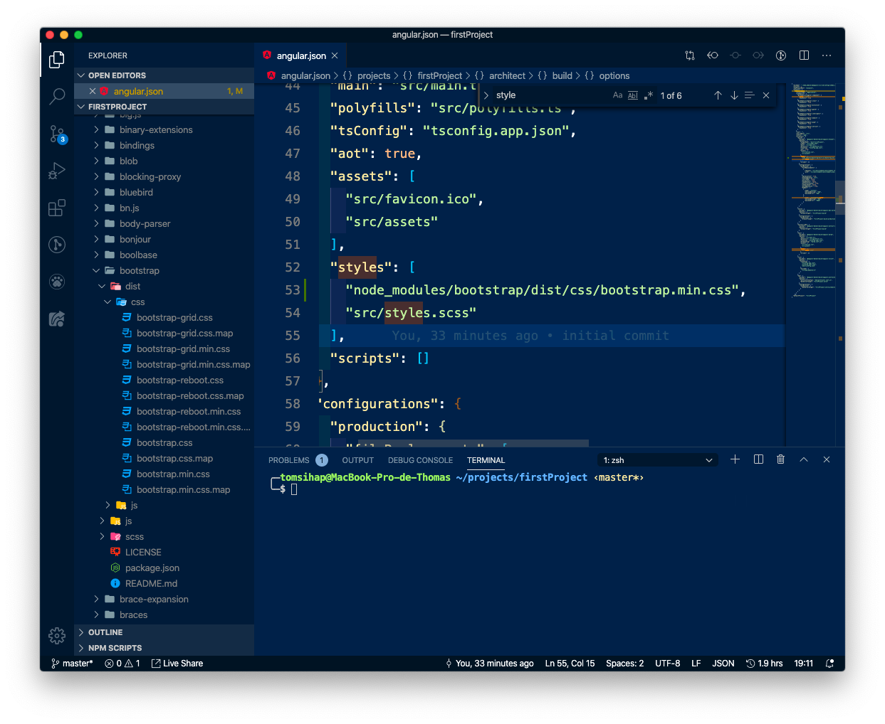

### Lancer notre projet Angular

Bon, à quoi ça ressemble Angular au fait ? Lançons le projet pour savoir !

Vu le nombre de fichiers, on se demande comment tout cela fonctionne. Où se trouve `index.html` ? Où sont les css, les js, à quoi servent tous ces dossiers ?! En fait, Angular va compiler tous ces fichiers en un projet qui sera distribué sur un serveur web. Et pour cela, vous allez saisir la commande suivante :

```bash
ng serve --open
```

Après quelques moulinages, une page de votre navigateur devrait s'ouvrir (grâce à `--open`) ! Il s'agit de `localhost:4200` : c'est un serveur qui a été créé localement (localhost, c'est votre machine), sur le port 4200.

Bravo, votre premier projet Angular est lancé. Il ne manque plus qu'à le personnaliser !

> Profitez d'être sur cette page pour découvrir de nouvelles lignes de commande et découvrir la documentation de Angular !

> On remarque que les boutons sont moches : en fait, c'est à cause du style Bootstrap que nous avons importé. Eh oui, quelle idée nous avons eu là, Angular vient déjà avec son style (Material Design) !


Une fois les liens étudiés, allons modifier cette page : il s'agit du fichier `src/app/app.component.html`.

--- 
### Exercice
> Supprimez tout (oui, tout !) le contenu de ce fichier et écrivez un simple `<h1>Hello World</h1>`. Actualisez... Euh non, n'actualisez pas : la page devrait s'actualiser toute seule à chaque sauvegarde de fichier !
--- 


## Notre premier component

Angular est composé en *components*. Ce sont des petites briques d'éléments sur la page qui sont réutilisables et qui auront chacune une fonctionnement qui lui est propre. 

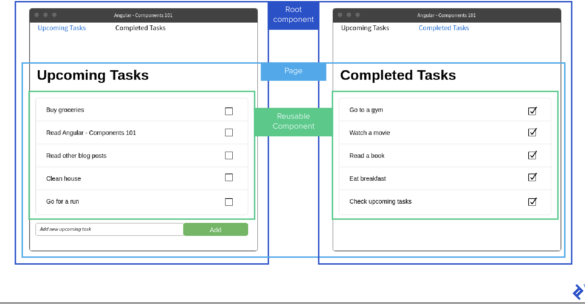

C'est un peu comme `body` ou `div` en HTML, mais en bien mieux !

Le component le plus  élevé, c'est `app-root`. On préfixe par convention les noms des components par `app`.

Dedans, on peut avoir un component pour la barre de navigation, pour un bloc de données (dans l'exemple, la liste de tâches), pour une seule donnée qui sera répétée (dans l'exemple, une tâche elle-même)...

Un des avantages, c'est que notre code pourra être séparé en plusieurs petits éléments, et plutôt que d'avoir un seul fichier HTML avec 400 lignes de code, nous aurons plutôt cinq ou six fichiers HTML avec beaucoup moins de code !

Au delà de diviser notre code, les components permettent des interactions entre eux et des fonctionnements qui rendront dynamiques nos pages. Par exemple, comme dans l'image : vous voulez cliquer sur le lien "Completed Tasks" pour voir les tâches complétées ? Très bien, au lieu de recharger toute la page, on n'a qu'à changer le component des tâches !


Pour créer votre premier component, commencez par quitter le serveur afin d'avoir de nouveau accès à la ligne de commande. Pour cela, en étant dans le terminal, faites `ctrl+c`.

Maintenant, créez votre premier component : 

```
ng generate component tasks-list
```

Ou en raccourci :
```
ng g c tasks-list
```

La ligne de commande devait vous indiquer que trois fichiers ont été créés et un fichier a été mis à jour : un dossier `tasks-list` a été créé et contient tout cela !

Intégrons ce composant dans notre page d'accueil en modifiant `app.component.html` :


Votre page devrait afficher quelque chose comme ça :

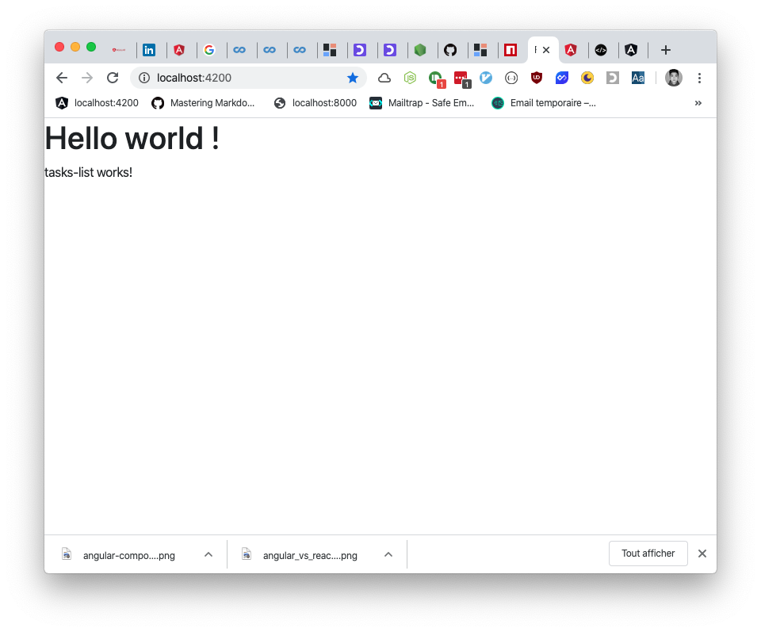

> Poursuivez sur les exercices 1 et 2 : [exercices](exercices.md)

> Poursuivez sur la partie 2 : [Partie 2](02.md)