# Angular 9 : Des données dynamiques ! - Cours

> Dans cette partie, nous allons voir comment rendre notre code dynamique. Dans le cours précédent, nous avons vu comment créer un projet et construire notre premier component.

> Nous allons maintenant construire un nouveau projet basé sur *Tour of Heroes*, l'appli d'exemple de la documentation officielle de Angular que vous pouvez [retrouver ici](https://angular.io/tutorial) !

> Il s'agit d'un dashboard de gestion pour une agence de recrutement de héros : on pourra ajouter, modifier, lister nos héros.

> Vous apprendrez à lire la documentation de Angular et commencer à trouver les informations par vous-même.

> Nous irons ensuite un peu plus loin que le tutoriel Angular pour ajouter une gestion de combat entre nos héros !

## Créer le projet
- Faites l'[exercice 3](exercices.md#exercice-3).

Au fait, comment est géré le component principal de notre application, celui qui contient les autres components ? En fait, il est appelé dans le fichier `src/index.html` avec la  balise `<app-root>`.

Ce `<app-root>` correspond en fait au `app.component` qui se trouve déjà dans le dossier `src` et qui est composé, comme tous les composants, de trois éléments :
- `app.component.html` ce qui va être affiché
- `app.component.scss` le CSS propre à ce component
- `app.component.ts` la logique de ce component

C'est quoi, la "logique" du component ? C'est en fait tous les mécanismes, les variables, le code Javascript (enfin, Typescript !) qui sera utilisé dans ce component.

La structure de ce fichier est un peu particulière : on y trouve une *classe* `AppComponent`, au dessus, un *décorateur* `@Component()`... On découvrira petit à petit tous ces éléments.

Mais pour commencer, travaillons dans la classe `AppComponent` et ajoutons-lui une variable nommée `subTitle` et qui contiendra `"Ma première application Angular !"`.

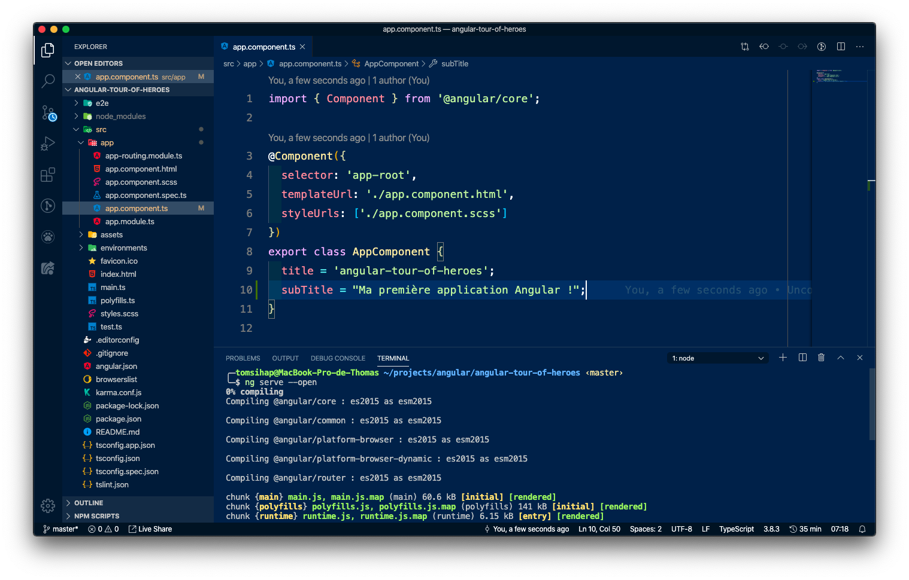

C'est une variable un peu particulière : par de `var`, `let`, `const` ici ! En fait, quand on déclare une variable dans une classe, on appelle ça un *attribut*. C'est une variable un peu particulière qui appartient à la classe.

## Les classes

Une classe est une structure de code qui nous permet de stocker des informations bien triées dedans. Par exemple, un array ou un objet vous permettent de stocker et trier des lots d'informations (un array de noms, un array de pays avec ses habitants et sa capitale...).

Une classe, c'est un array... En mieux ! À un array, on peut lui donner toutes les informations que l'on souhaite, par exemple :

```js
let countries = [
    {
        name: "France",
        capital: "Paris",
        population: 66990000
    },
    {
        name: "Germany",
        capital: "Berlin",
        population: 82790000
    }
]
```

Mais on peut aussi lui donner des informations un peu bizarres sans aucun contrôle :
```js
let countries = [
    {
        name: "France",
        capital: "Paris",
        population: 66990000
    },
    {
        name: "Allemagne",
        capital: "Berlin",
        population: 82790000
    },
    {
        name: "Jar-Jar Binks",
        capital: "Otoh Gunga",
        friends: [
            "Qui-Gon Jinn",
            "Obi-Wan Kenobi"
        ]
    }
]
```

Une classe, c'est en fait un "super array" à qui on va définir le format de base, des données par défaut, pour éviter ce genre d'erreurs !

> Attention : à partir de maintenant, le code que nous saisissons est du Typescript. C'est à dire qu'il ne fonctionnera pas dans un fichier Javascript classique. Au final, lorsque l'on compile le Typescript, un fichier Javascript est créé en bout de file. L'avantage de Typescript, c'est donc d'utiliser des fonctionnalités avancées que Javascript seul n'a pas (ou qui sont difficiles à coder en Javascript natif, ou encore des fonctionnalités pas encore sorties).

Pour définir ce "format", nous allons dire qu'un pays doit avoir une capitale (en `string`) et une  population (en `number`). De plus, nous allons nommer notre classe `Country` puisqu'elle représente un pays.

- Créez le fichier `src/app/Country.ts`. Attention au `C` majuscule ! Cette notation s'appelle `PascalCase` et est une convention obligatoire pour le nommage des classes.

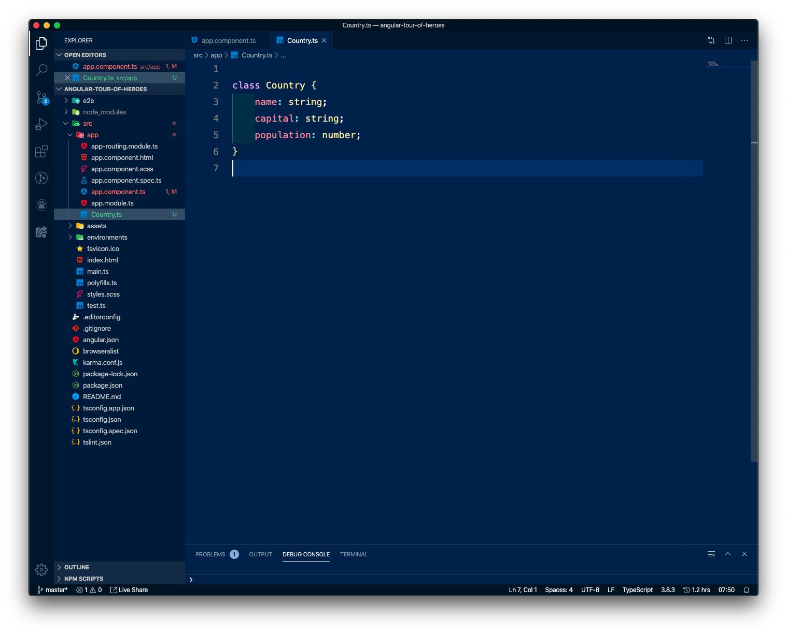

Et voilà ! Je peux maintenant créer des pays sans risquer d'ajouter un champ inutile (auquel cas mon IDE me mettra une erreur !) :


Une classe, c'est aussi un nouveau type de données. De la même manière que `string` est un type de données qui possède tous les caractères possibles, `number` un type de données qui ne possède que des chiffres ou `object` qui possède plusieurs strings, numbers et sous objets, `Country` est un type de données qui possède une string `capital` et un number `population`.

Pour illustrer cela, vous pouvez créer une classe `Continent` (dans le même fichier pour cette fois car c'est un exercice) qui elle, contiendra un attribut `countries` qui prendra un tableau d'éléments de type... `Country` !

- Pour indiquer un tableau de string, on type avec `string[]`.
- Pour indiquer un tableau de `Country`, on type avec `Country[]`.

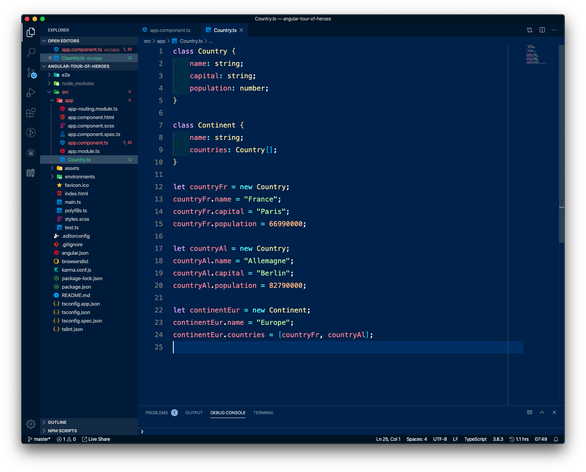

- Faites l'[exercice 4](exercices.md#exercice-4).
- Faites l'[exercice 5](exercices.md#exercice-5).

## Interpolation

Maintenant que notre classe possède des attributs, nous allons les utiliser à la manière de Angular pour les afficher dans notre page !

Angular possède un moteur de template qui permet par exemple d'utiliser dans la partie HTML des variables qui viennent de la partie Typescript. On appelle ça l'interpolation : c'est un mot savant qui veut simplement dire "insérer une variable qui vient d'un autre fichier" ! (mais c'est bien pour raconter son job à des amis : *j'ai du relancer mon serveur Angular parce que l'interpolation ne voulait pas marcher correctement mais sinon bonne journée et toi ?* 😎)

Concrètement, nous pouvons utiliser les variables définies dans la partie Typescript du component (ici: `app.component.ts`) en les appelant dans la partie HTML du component (ici: `app.component.html`) en saisissant le code suivant:

> Note: vous pouvez supprimer l'intégralité du contenu de `app.component.html` comme d'habitude sans risques : c'est simplement le code qui vient par défaut à la construction de l'application !

> N'oubliez pas de relancer votre serveur si ça n'est pas déjà le cas !

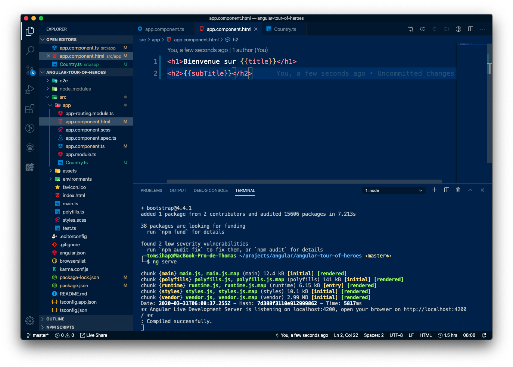

Vous allez maintenant mettre en pratique toutes vos connaissances pour créer un component `heroes` qui contiendra la liste des héros.

- Faites l'[exercice 6](exercices.md#exercice-6).

Notre composant s'affiche, parfait ! Nous allons maintenant définir ce qu'est un héros. Il doit avoir :
-  un `id` (pour  l'identifier parmi ses pairs !), de type `number`
-  un `name` (idéalement, qui passe bien au cinéma !), de type `string`

Nous avons un outil pour définir un ensemble de données: ce sont les classes ! Pour notre exercice, nous allons utiliser un type spécial de classes, ce sont les interfaces. Elles fonctionnent presque comme des classes et nous détaillerons plus tard leur mécanisme :


Nom du fichier: `NomDeLinterface.ts`
```ts
export interface NomDeLinterface {
    attribut: type;
}
```

L'intérêt de nos interfaces (ou classes), c'est de les utiliser dans un component qui utilisera ce modèle de données. Pour l'importer, il faut l'indiquer dans les imports de notre component sous la forme de :

```ts
import { ElementAImporter } from '../chemin/relatif/du/fichier/source';
```

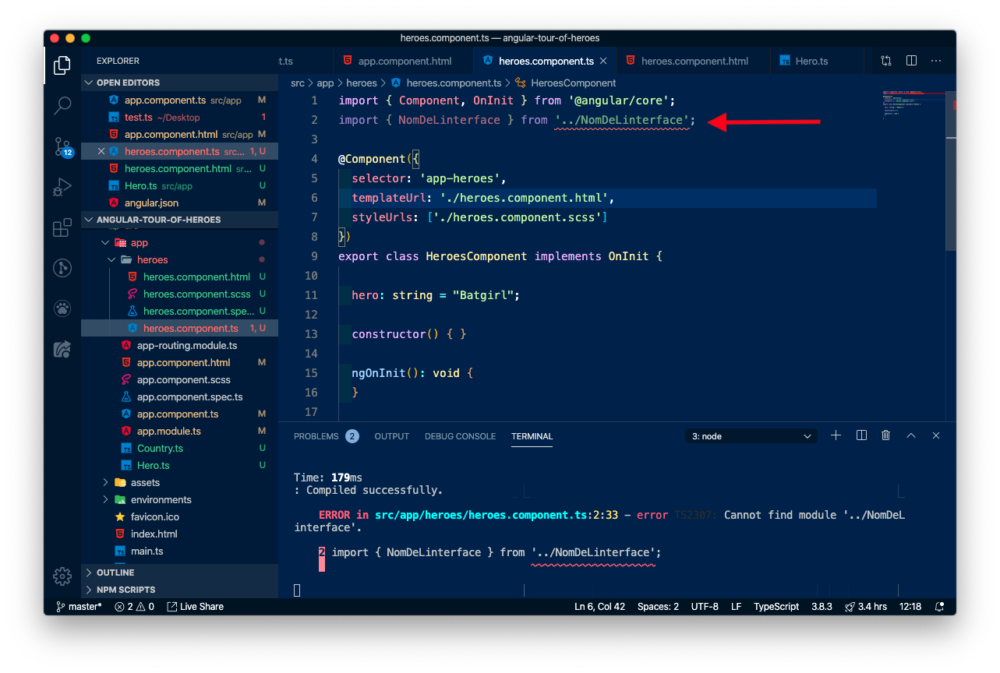

> Note: nous avons indiqué "export" dans le fichier de l'interface, car lorsque l'on appelle ce fichier, on veut dire que l'interface est disponible à l'extérieur, par le fichier qui l'a importé.

> Du coup, quand on fait un "import", on précise ce que l'on veut importer du fichier (ici, `NomDeLinterface`).

- Faites l'[exercice 7](exercices.md#exercice-7).
- Faites l'[exercice 8](exercices.md#exercice-8).

## Databinding

Dans nos composant Angular, nous allons être capables de communiquer et modifier des données dans deux sens :
- depuis le HTML vers le Typescript (mon utilisateur change les données d'un formulaire, clique quelque part par exemple) : on écoute un évènement, c'est du `event binding`

- depuis le Typescript vers le HTML : un fonction, méthode, des données issues d'une API... qui changent une donnée d'affichage : ça touche aux attributs (properties) du component, c'est du `property binding`.

> L'interpolation, c'est une des manières de faire du property binding !

### Event Binding

Nous allons lier un évènement venant du HTML à une action dans le Typescript. Par exemple, quand l'utilisateur clique sur le nom du héros, on envoie un `console.log()` pour dire que le héros a été cliqué.

Dans l'ordre, nos tâches sont :
1. Écrire l'action à effectuer dans le Typescript
2. Attacher un event listener dans le HTML


#### 1. Écrire l'action à effectuer

Nous allons écrire une fonction dans notre classe `HeroesComponent` qui s'exécutera lors du clic sur un héros.

> Une fonction dans une classe ?! Si on se souvient bien de ce qu'est une classe... C'est une représentation de données, une sorte de super array. Une des particularités qu'ont les classes en plus des arrays, c'est d'avoir des actions à effectuer ! Ce sont en fait des fonctions comme on les connaît déjà en Javascript. Mais comme elle se situe dans une classe, on appelle ça une méthode. Donc en résumé, quand on fera de la programmation orientée objet, on parlera de :
> Procédural | Orienté objet
> ---------|----------
>  Variable | Attribut
>  Fonction | Méthode

Ajoutez dans `heroes.component.ts` la méthode suivante :

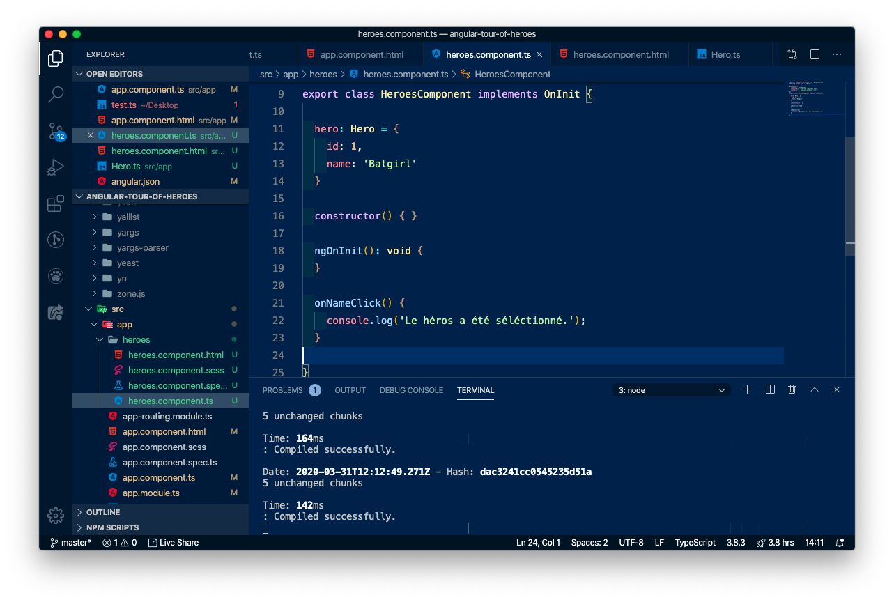

#### 2. Attacher un event listener

Modifiez le `heroes.component.html` pour ajouter un event listener qui déclanchera la méthode créée ci-dessus. Angular est capable  d'écouter tous les évènements du DOM comme expliqué dans la doc [ici](https://angular.io/guide/user-input), nous allons choisir l'event `click`.

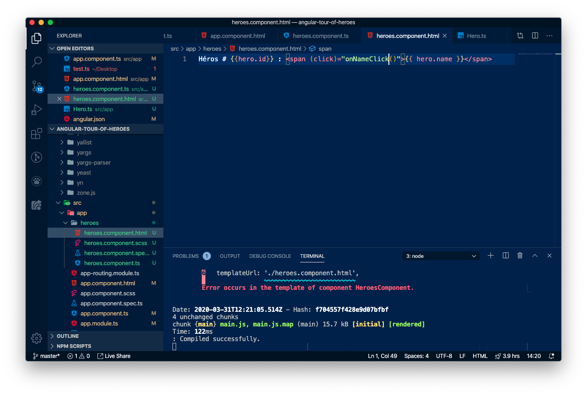

Si tout se passe bien, en cliquant sur le nom du héros, un message devrait apparaître dans la console du navigateur !

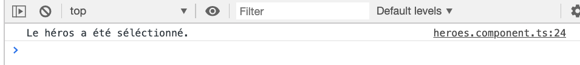


### Property Binding

Nous allons voir une autre manière que l'interpolation de lire des données venant du Typescript. Cette fois, imaginons que notre liste de héros ne peut pas être embauchée pour le moment. Créons un attribut pour cela :

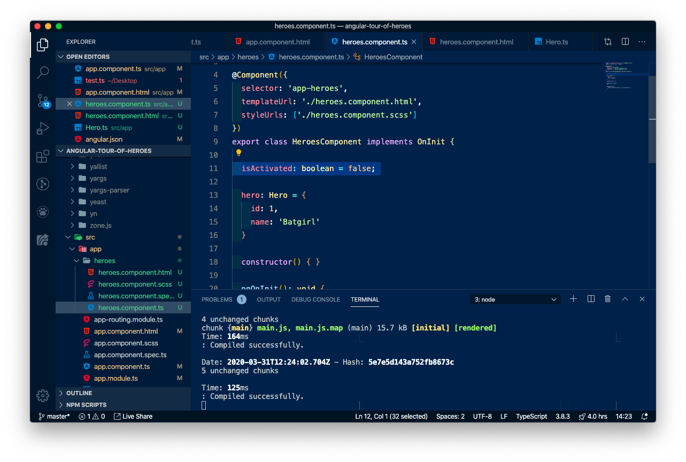

> Normalement, cette donnée viendrait d'une base de données que Angular consulterait avec une API. Comme nous ne savons pas (encore!) le faire, nous simulons cette donnée en l'écrivant en dur.

Dans le HTML, créons un bouton "Embaucher" qui ne sera actif que si `isActivated` est vrai (donc : il sera `disabled` si `isActivated` n'est pas vrai) :

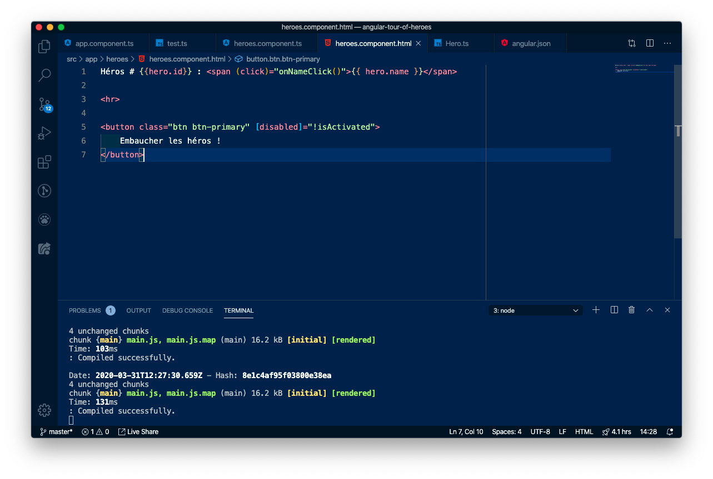

Et voilà ! Testez en changeant la valeur du booléen pour voir tout fonctionne bien. Par exemple ci-dessous, on a `isActivated = false`, le bouton est `disabled` :

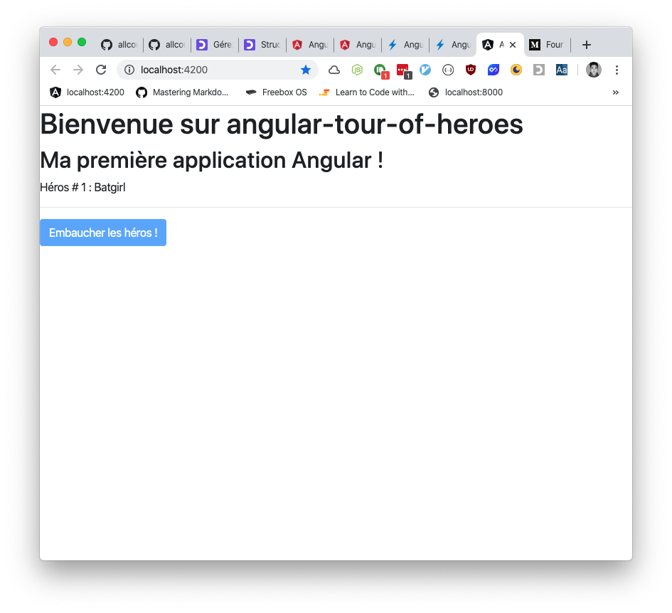

- Faites l'[exercice 9](exercices.md#exercice-9).

### Two-Way Binding

Cette-fois, nous allons voir comment rattacher les données... Dans les deux sens (two-way) en même temps ! Par exemple :

1. une variable sert de nom à l'affichage (property binding)
2. l'utilisateur modifie un formulaire... (event binding)
3. ... ce qui modifie la variable de nom (property binding)

- Faites l'[exercice 10](exercices.md#exercice-10).

À l'issue de l'exercice 10, vous devriez avoir un formulaire qui contient le nom du héros. Ce que nous souhaiterions faire, c'est de pouvoir changer le nom du héros en temps réel lorsque nous modifions le champ du formulaire !

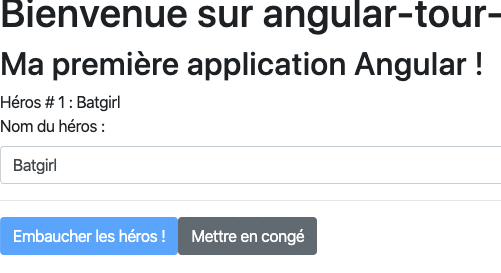


Pour cela, nous allons un peu changer notre formulaire et lui dire que sa donnée vient d'un `Model` (un Model, c'est une représentation de donnée en POO), et ce model, c'est l'attribut `hero.name`.

Et comme c'est un binding dans les deux sens (event/property)... On  utilisera à la fois `[]` et à la fois `()` !

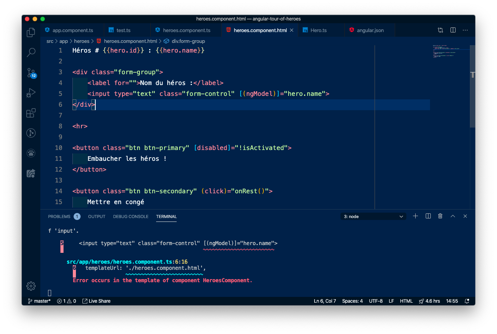

Par contre, on a maintenant une erreur de compilation. Ce `ngModel` se sert d'un module que nous avons oublié d'importer ! Ajoutez la ligne d'import suivante dans le Typescript :

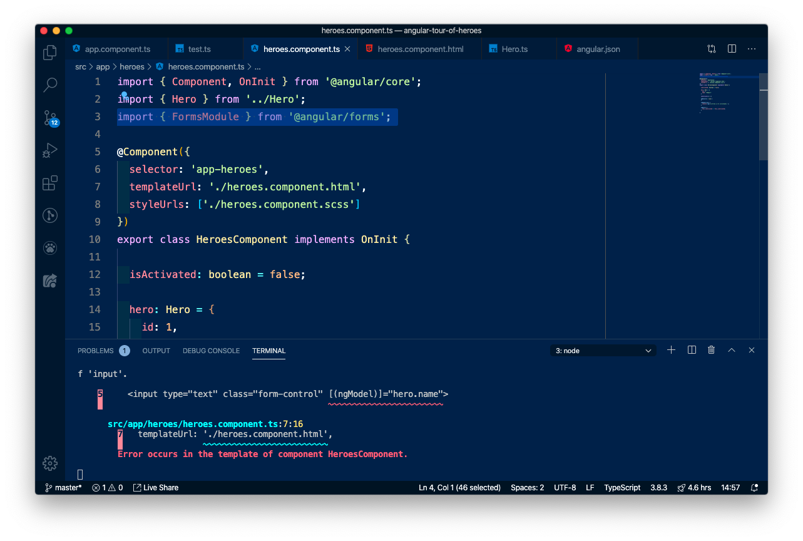

Enfin, comme il s'agit d'un import qui vient de l'extérieur du projet (à l'inverse de `Hero.ts` qui lui vient de l'intérieur du projet), nous devons appeler ce module dans un fichier de configuration nommé `app.module.ts` :

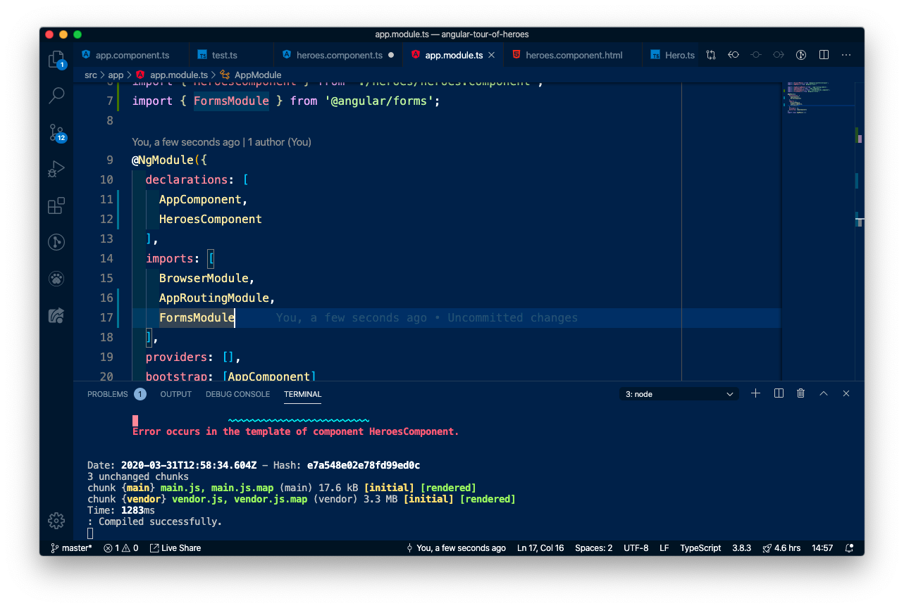


> Remarquez que dans ce fichier, on y trouve aussi `HeroesComponent` ! Cette déclaration est obligatoire pour chaque component et c'est `ng g c` qui a mis à jour ce fichier pour nous.

- Faites l'[exercice 11](exercices.md#exercice-11).
