# Angular 9 - Partie 3 : Les directives
> - [Retourner à la liste des cours](../readme.md)
> - Exercices : [cliquez-ici](exercices.md)
> - Corrections : [cliquez-ici](corrections.md)

- [Angular 9 - Partie 3 : Les directives](#angular-9---partie-3--les-directives)
  - [Mocking de data](#mocking-de-data)
    - [Séléctionner un héros](#s%c3%a9l%c3%a9ctionner-un-h%c3%a9ros)
    - [Gérer la séléction d'un héros](#g%c3%a9rer-la-s%c3%a9l%c3%a9ction-dun-h%c3%a9ros)

Nous allons apprendre à structurer nos components grâce à des directives : ce sont des instructions que nous injections directement  dans les balises afin de leur indiquer un comportement particulier.

- Les directives structurelles : elles servent à structurer notre page en créant des éléments quand nécessaire, il s'agit en fait de conditions et de boucles ! Par exemple, afficher une `div` sous telle condition, afficher ce `li` autant de fois que nécessaire...

- Les directives par attribut : là où les directives structurelles crééent des éléments, les directives par attribut modifient des éléments existants. Concrètement, elles nous permettent d'ajouter des styles et des classes conditionnels.

## Mocking de data

Notre application de gestion de héros fonctionne bien... Pour un seul héros. On peut imaginer que dans un cas réel, notre application ira récupérer les données d'une base de données et que plusieurs héros seront à gérer !

Pour cela, nous allons *mocker*, c'est à dire simuler, des données.

Créez le fichier `src/app/mock-heroes.ts`, qui contiendra un tableau d'objets `Hero`.

Pour cela, nous importons l'interface `Hero` de sorte à ce que le fichier la reconnaisse, et nous exportons un tableau constitué d'objets `Hero` (on définit ce tableau par le type `Hero[]`) :

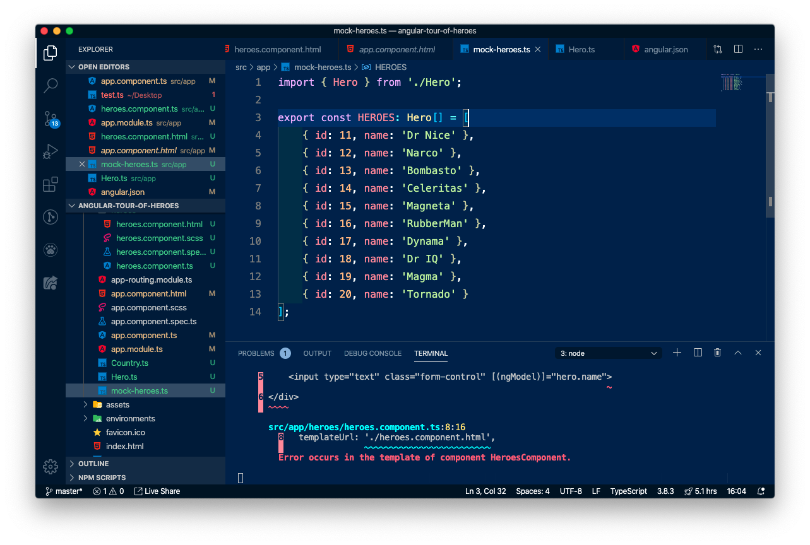

Ensuite,

1. nous allons importer ce fichier dans notre composant `app-heroes`, de sorte à ce qu'on puisse utiliser ce tableau au sein de notre composant, 
2. nous allons supprimer notre attribut `hero` existante pour la remplacer par un attribut `heroes` qui contiendra notre liste de héros.

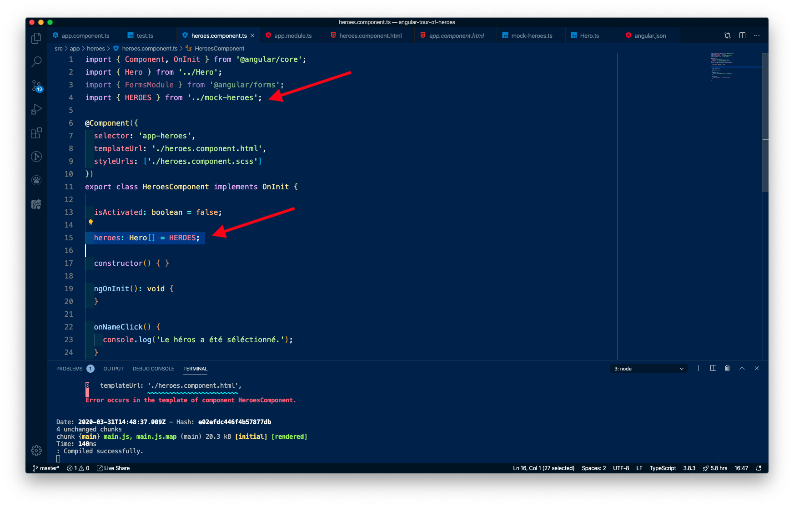

Du coup, un souci se pose (d'ailleurs, le serveur bugue !) : dans la partie HTML du component, on demande : `hero.name` et `hero.id`, qui sont des propriétés de l'attribut `hero`.

Hors, nous venons de le supprimer et de le remplacer par `heroes` (qui lui, contient de `Hero` !)

Nous allons donc dire à notre HTML de faire une boucle sur ce nouveau tableau `heroes` pour afficher nos éléments. On en profite pour changer le visuel et mettre une liste `ul>li`. Dans le  `li`, nous mettrons le code existant de l'affiche d'un seul héros :

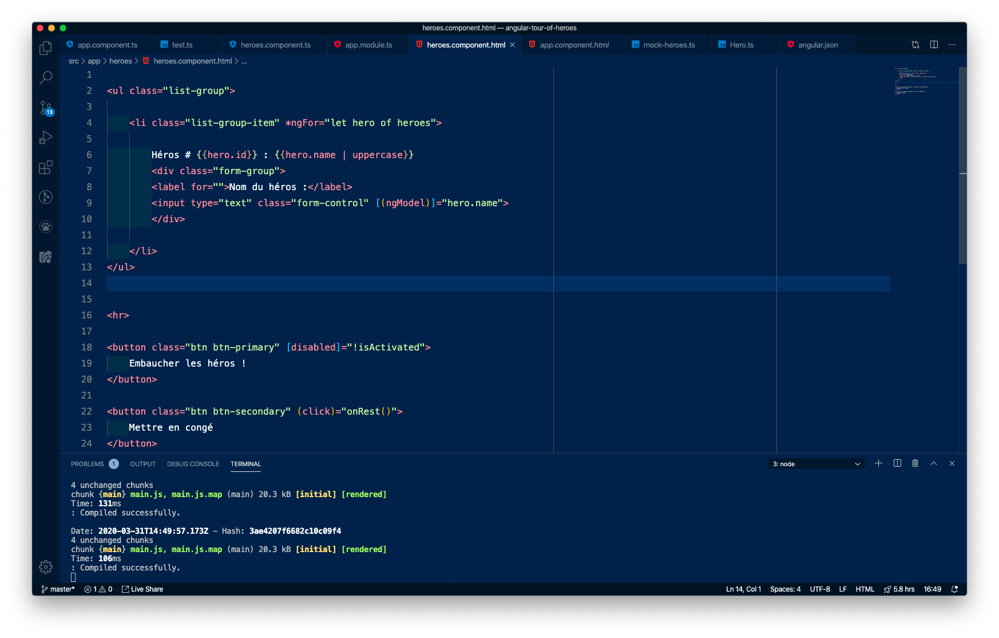

Et voilà : grâce à la directive `*ngFor`, nous avons pu dire à notre code : "pour chaque `hero` du tableau `heroes`, fais un `li` qui ressemble à ça".


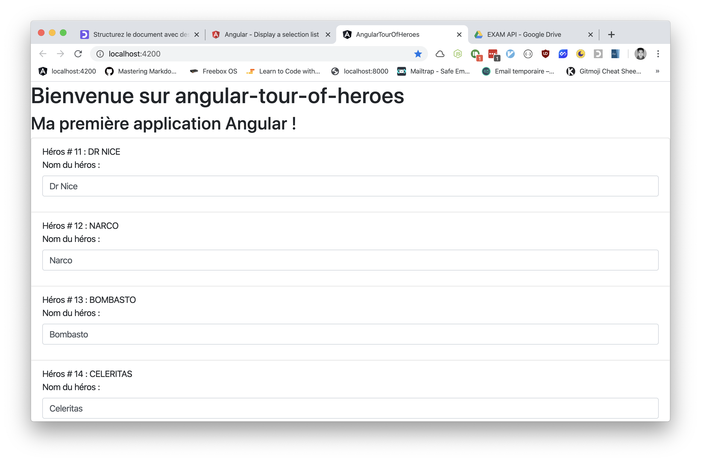

### Séléctionner un héros

Maintenant que nous avons tous nos héros, nous allons gérer la séléction d'un héros pour afficher ses détails à droite de la page. Stylisons un peu mieux notre page pour travailler cette idée. 

Nous allons utiliser les colonnes Bootstrap pour faire une colonne de héros, et une colonne de "modification".

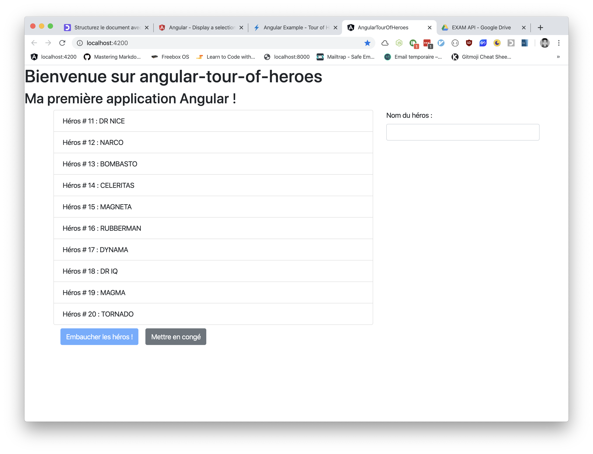

Le code pourrait être comme suit :

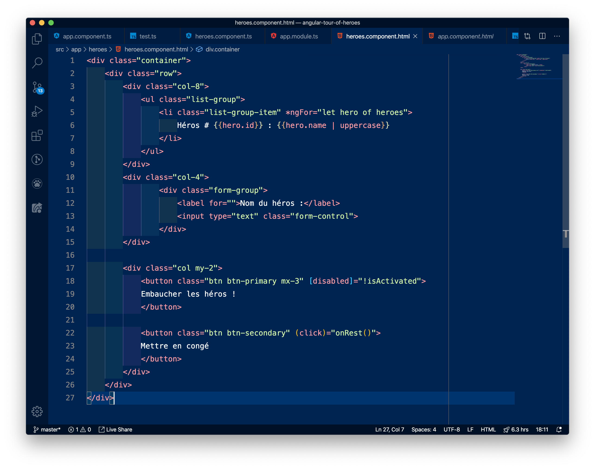

> Remarquez que comme notre formulaire n'est plus dans la boucle `*ngFor`, il ne peut plus connaître la variable `hero.name`. Donc, on enlève le ngModel pour l'instant pour éviter un bug !

### Gérer la séléction d'un héros

Pour cela, nous allons avoir besoin de l'event binding: en effet, quand je clique sur un `li`, j'ai besoin d'indiquer au Typescript qu'un héros a été séléctionné. On écoute donc le `(click)`  sur le `li`, et on appelle une méthode. Ça tombe bien, on a déjà `onNameClick()` qui existe !

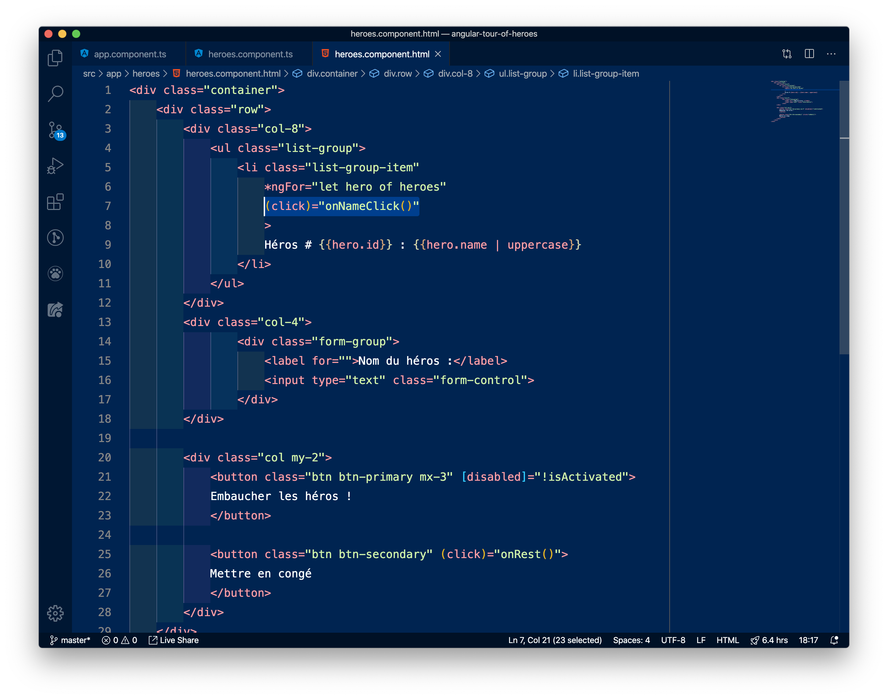

> Remarquez que nous écrivons les attributs de `li` en colonne. Tout fonctionnee pareil, c'est juste plus facile à lire !

Modifions maintenant cette méthode `onNameClick()` pour qu'elle prenne en paramètres un héros cliqué.


- On modifie l'appel de la méthode dans `heroes.component.html` pour lui passer le paramètre `hero`
- On modifie la méthode dans `heroes.component.ts` pour lui ajouter un paramètre de type `Hero`
- On modifie la méthode pour lui dire d'afficher dans un `console.log` le héros qui a été cliqué pour voir si tout fonctionne !

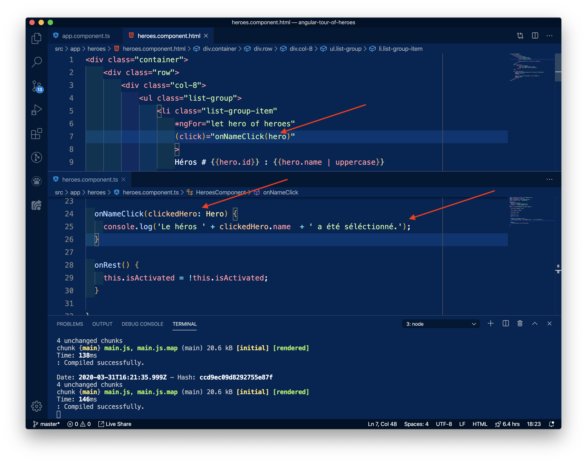
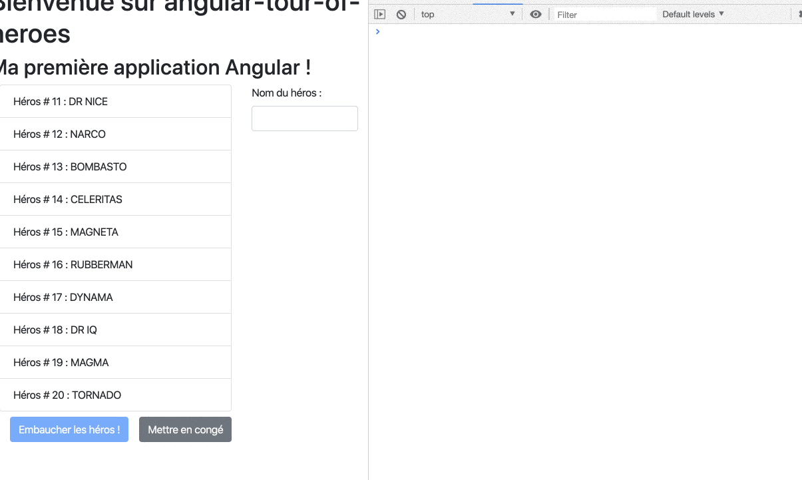

> Ouf ! Ça fait déjà beaucoup d'informations. On a pris quelques briques qu'on connaissait (les fonctions, l'event binding, la classe Hero...) pour réussir à faire en sorte que notre application Angular détecte quel héros a été cliqué, quand je clique n'importe où dans le `li` !

> Prenez un moment pour bien comprendre ce code avant de passer à la suite.

Maintenant que notre héros est détectable, nous allons faire en sorte que notre fichier Typescript soit bien au courant. Pour cela, nous allons :
1. Créer un attribut  `selectedHero: Hero`
2. Attribuer à cet attribut le héros qui a été séléctionné.

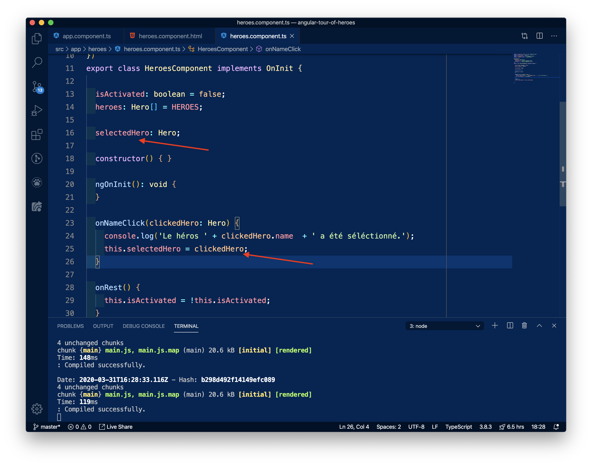

Grâce à cet attribut, on est maintenant capable de tester si à tout moment il existe un héros qui a été cliqué. Et justement, concernant notre colonne de détails... Elle ne devrait s'afficher seulement si un héros a été cliqué ! On va pour cela utiliser la directive `*ngIf` qui affiche conditionnellement quelque chose. Ici, au démarrage de notre application, `selectedHero` est vide. Mais lorsqu'on le clique, il est rempli. Notre `div` s'affichera donc uniquement lors du clic !

Ajoutez le `*ngIf` :
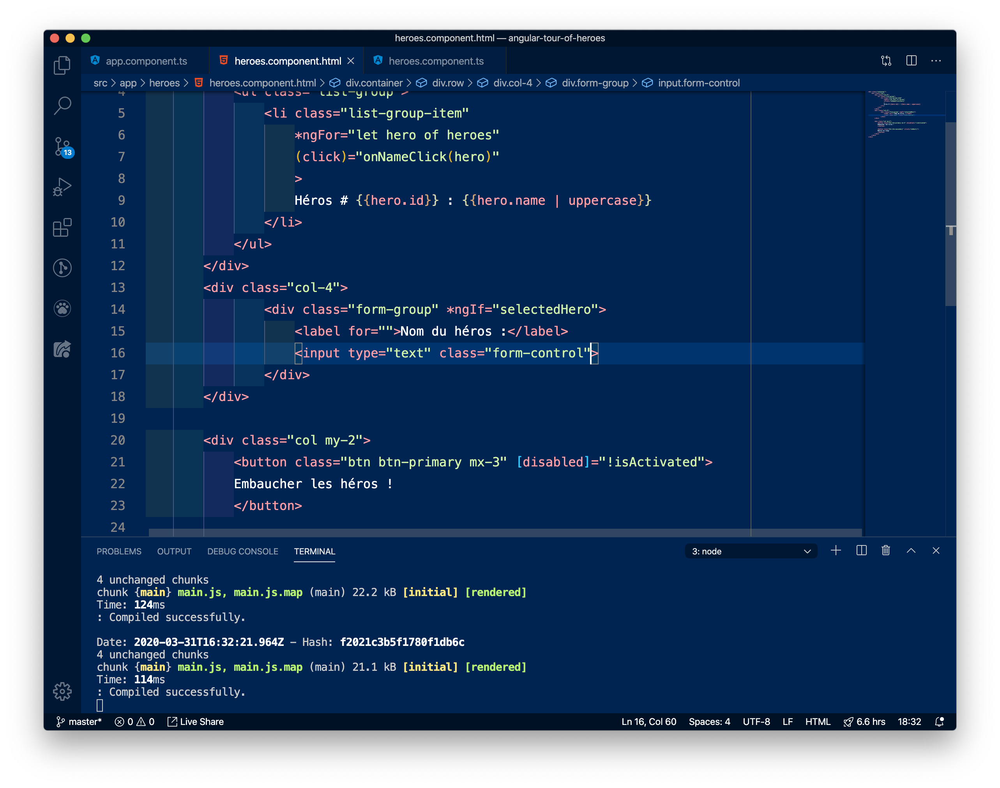
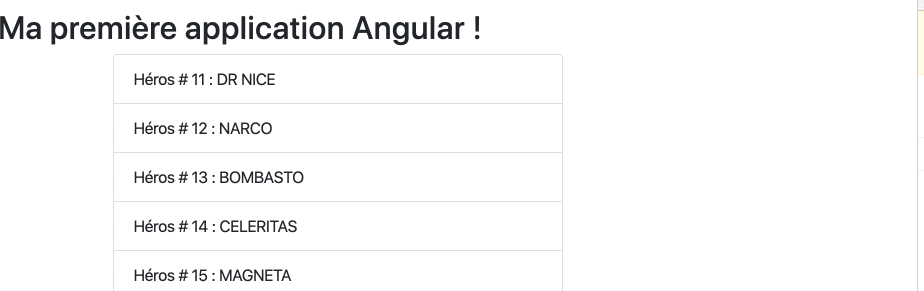

Parfait !

Et maintenant, dans cette div, notre code a accès à un héros. Ça tombe à pic : on peut réécrire notre `ngModel` pour lui dire de se rattacher au héros qui a été cliqué !

Rajoutez le `ngModel` :
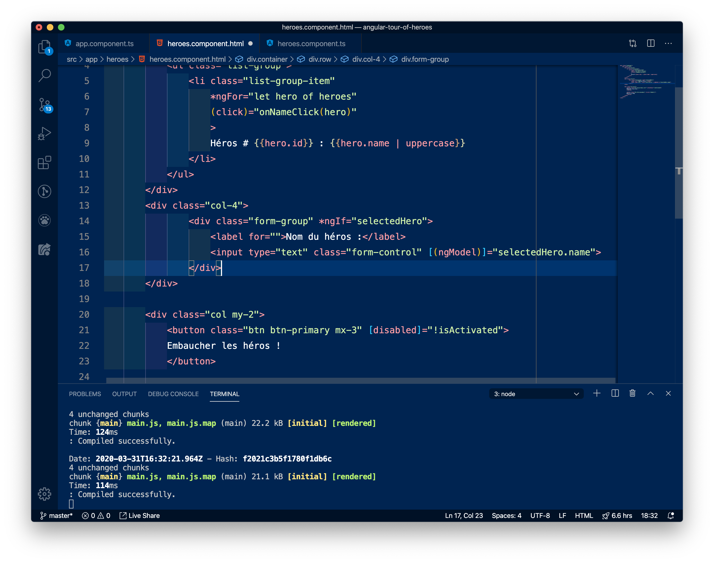
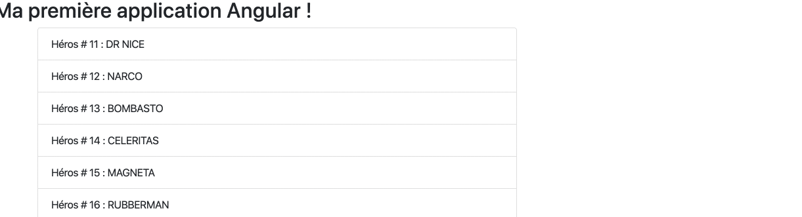

> Note de culture générale: ngModel fonctionne ici alors que nous avons deux variables différentes (un héros issu de `heroes`, et un héros dans `selectedHero`). Tout cela fonctionne grâce à un design pattern nommé Singleton : grocièrement, il s'agit pour l'application de n'avoir qu'un seul exemplaire de chaque objet en mémoire. Donc quand on séléctionne un héros, l'application sait que ce héros est déjà en mémoire, elle fait un "lien symbolique" vers cet emplacement mémoire où le héros se trouve. Ainsi, avec ngModel, on est certains de n'avoir qu'une seule copie du héros et tout le component ne traite qu'avec les même héros !

Enfin, nous allons fair en sorte que la ligne séléctionnée se mette en surbrillance quand elle est cliquée.

Bonne nouvelle : il existe une classe Bootstrap pour ça ! 😄 Il s'agit de la classe `active` à rajouter à notre `li`.

Nous sommes dans une boucle for qui affiche tous les héros. Durant l'exécution de cette boucle, la condition pour que la ligne séléctionnée s'affiche est : *est-ce que le `selectedHero` correspond au `hero` que je suis en train d'afficher dans la liste ?* si oui, j'ajoute la classe `active`.

Cette condition dépend donc d'une donnée de Typscript, notre attribut (property) `selectedHero`. On a donc besoin d'un... Property binding !

Il s'écrit comme ça :

```html
<li [class.nomDeLaClasseaAjouter] = "condition-à-respecter">
```

Si la `condition-à-respecter` est valide, alors la classe `nomDeLaClasse` sera rajoutée à notre `li`.

Ici, on a :
- classe : `active`
- condition: `hero === selectedHero` (hero étant le héros qui est en train d'être affiché, de la boucle `let hero of heroes`)

On écrit donc :


Ça y est, on s'en sort, notre application est complète !

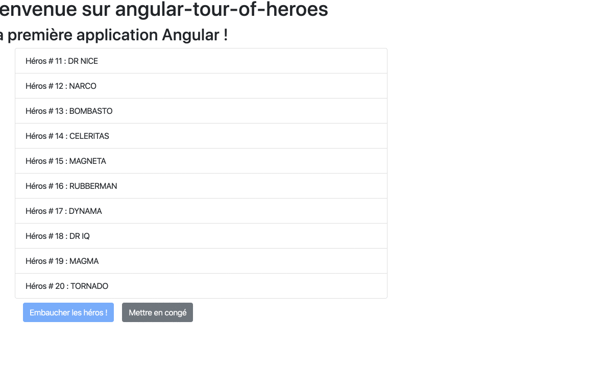

- Faites l'[exercice 12](exercices.md#exercice-12).
- Faites l'[exercice 13](exercices.md#exercice-13).
- Faites l'[exercice 14](exercices.md#exercice-14).
