# Angular 9 - Partie 4 : Communiquer entre components

Notre application est bien complète ! Néanmoins, nous avons pour l'instant qu'un seul component qui gère l'ensemble. Voyons comment découper notre application pour la rendre plus flexible :


```
app-root : racine de notre projet
    heroes : liste des héros
        hero: un seul héros
        hero-detail : détail d'un héros
    heroes-actions: boutons d'actions
```

## Déplacer les éléments dans les bons composants

- Faites l'[exercice 15](exercices.md#exercice-15).

Après cet exercice, le code est maintenant mieux structuré. Il ne nous reste plus qu'à déplacer les éléments correspondants à nos nouveaux components à l'intérieur de ceux-là !

Commençons par déplacer le bloc de détails d'un héros dans `app.hero.detail` :

1. On enlève le code de `app.heroes` qui nous intéresse et on laisse l'appel à `app.hero.detail`...
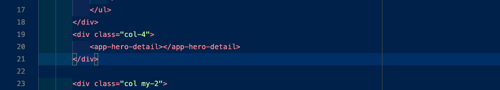

2. Pour le mettre dans `app.hero.detail`:
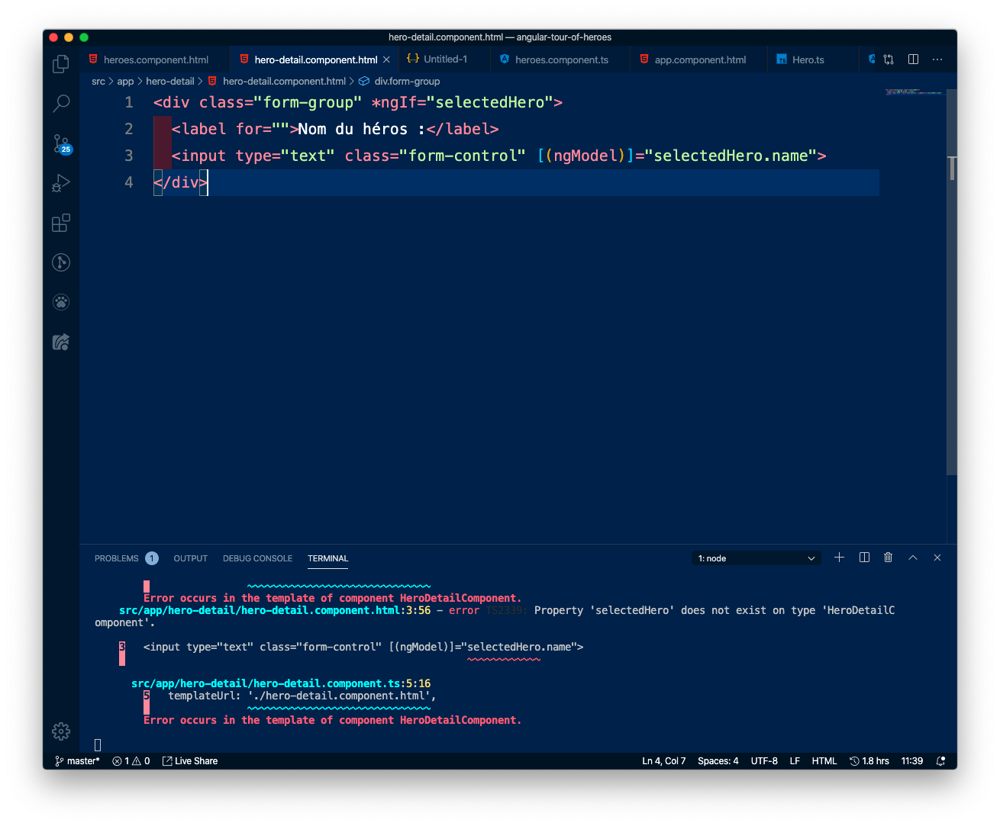

Par contre, nous avons maintenant un bug : en effet, `app.hero.detail` a besoin d'un attribut `selectedHero` pour fonctionner !

## Envoyer une donnée vers un composant enfant

Nous allons devoir dire à `app.heroes` que lorsqu'un héros est séléctionné, il doit envoyer cette donnée à `app.hero.detail` pour que ce dernier le prenne en compte.

Autrement dit, `hero.detail` a besoin d'un `selectedHero` en entrée (en *input*) pour fonctionner !

- Créons un attribut `heroToShow` dans le composant `hero.detail`. Cet attribut contiendra un héros (`Hero`)... à afficher !

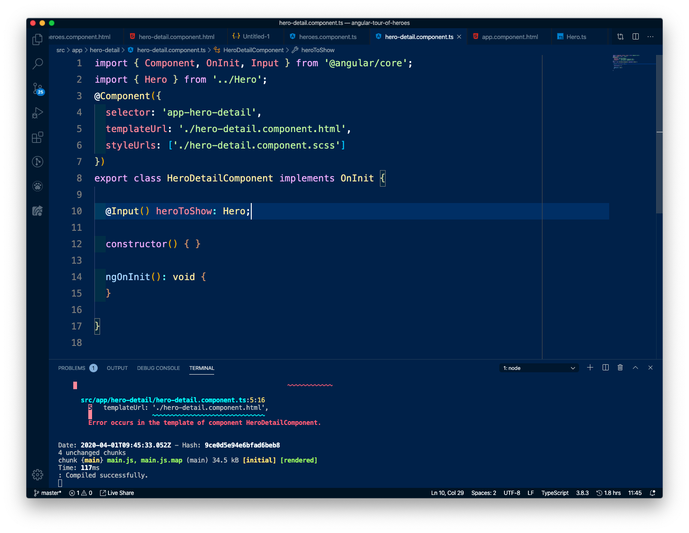

> Remarquez qu'il faut bien que `Input` s'ajoute dans la ligne 1
> Remarquez que nous avons du importer l'interface `Hero` pour que notre composant le connaisse

- Modifions aussi le HTML de ce composant `app.hero.detail` : en fait, nous avons plus tôt copié-collé le code existant, mais ce code utilisait `selectedHero`, qui est un attribut de `app.heroes`, donc l'autre. Nous, nous avons besoin de l'attribut `heroToShow` dans ce composant.

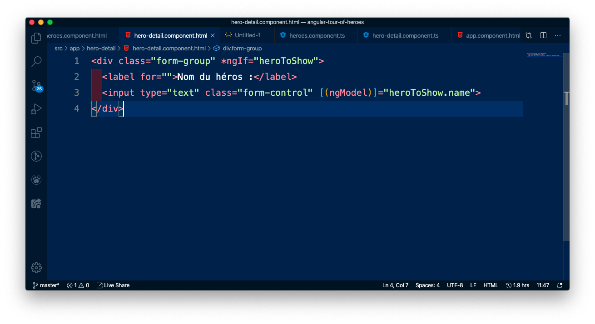

- Enfin, modifiez le HTML du composant `app.heroes` pour lui dire que, lorsqu'il appelle `app-hero-detail`, il doit lui passer en `input` un attribut `heroToShow` contenant un héros.

> Dans `heroes`, le héros séléctionné s'apelle `selectedHero`.
> Dans `hero-detail`, l'attribut est `heroToShow`.
> On assigne alors à `heroToShow` la valeur `selectedHero` !

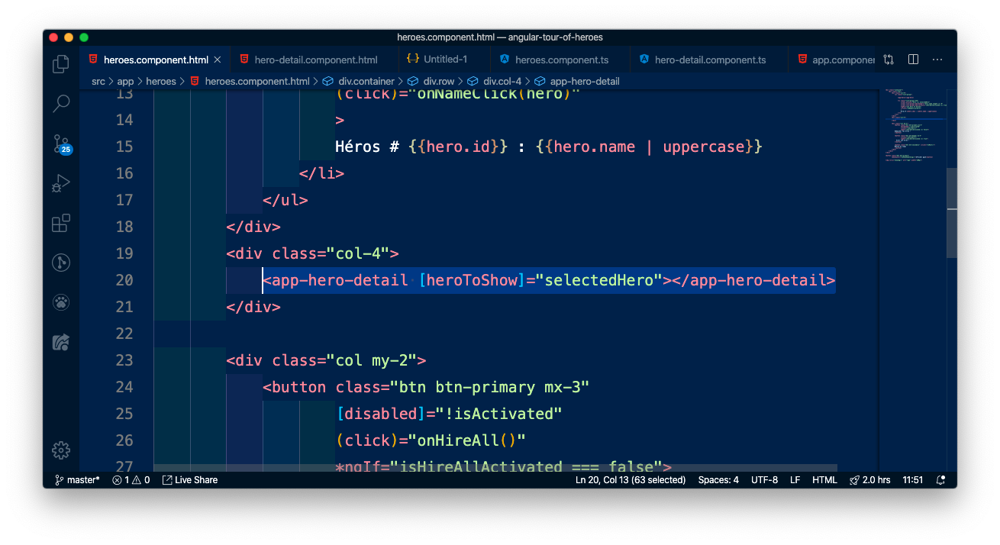

Et voilà, notre application devrait de nouveau fonctionner comme avant ! À la différence que notre code est maintenant un peu plus propre et mieux découpé.

#### En résumé
Pour passer une variable d'un composant parent (`heroes`) à un composant enfant `hero-detail` :
1. Dans le TS du composant enfant, on déclare un attribut dont on a besoin pour fonctionner en `@Input attribut`
2. Dans le HTML composant parent, on appelle notre composant enfant en lui passant l'attribut dont il a besoin pour fonctionner `<app-enfant [attribut]="valeur"></app-enfant>`

## Déplacer les boutons d'action dans le parent

Cette fois, nous allons déplacer les boutons d'action depuis `app.heroes` (ou `heroes`) vers `app.component` (ou `root`, comme *racine*) :
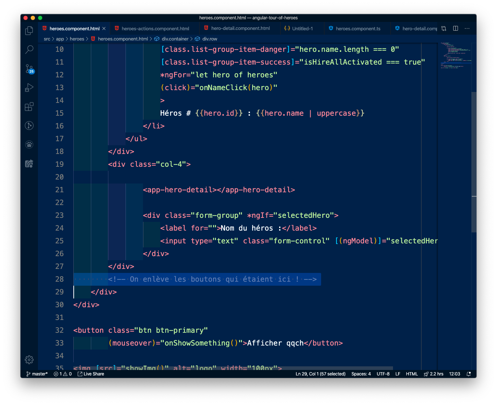

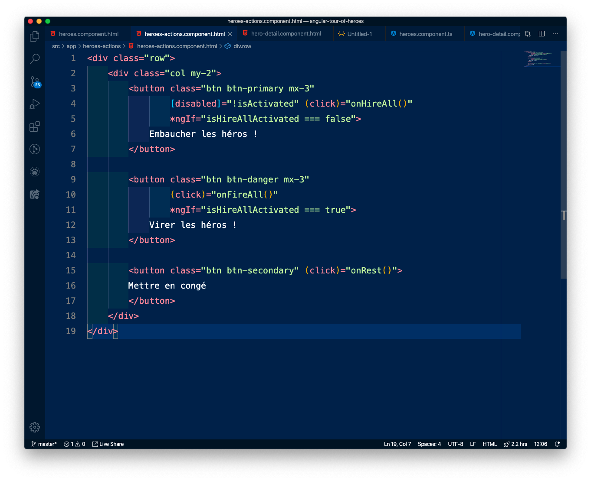

Si tout se passe bien, on devrait avoir un bug ! Les boutons ont tous disparu sauf "Mettre en congé". En effet, les boutons "Embaucher" et "Virer" ont  un affichag conditionnel (avec `*ngIf`), qui teste la valeur de `isHireAllActivated`.

Le problème, c'est que ce `isHireAllActivated` existe dans le composant "frère" `heroes`, et pas dans notre composant `heroes-actions`.

Nous allons devoir donc :

1. Déplacer l'attribut `isHireAllActivated` ainsi que les méthodes le concernant `onHireAll()` et `onFireAll()`, depuis `heroes` vers `heroes-actions`

2. On déplace également l'attribut `isActivated` et la méthode `onRest()` qui concernent eux aussi les boutons, depuis `heroes` vers `heroes-actions`


> On déplace les éléments de `heroes`...
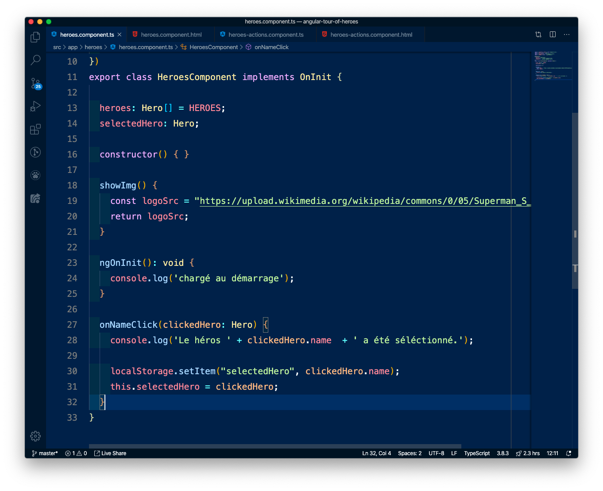

> ... vers `heroes-actions`.
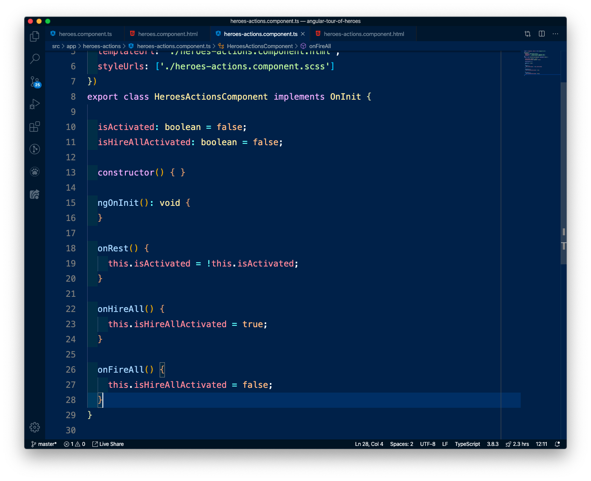

Normalement, les boutons devraient réapparaître et être cliquables ! De plus, on peut se rendre compte que notre code est déjà bien plus propre: ce qui concerne les boutons reste dans `heroes-actions`, ce qui concerne la liste de héros reste dans `heroes` !

Il nous manque plus qu'une information à gérer : lorsqu'il y a un changement sur les boutons, c'est à dire que le `isHireAllActivated` de `heroes-actions` change, il faut que les héros de `heroes` changent de couleur.

Pour comprendre comment procéder, rappelons-nous de l'hiérarchie de nos deux composants :

```
app-root
    app-heroes
    app-heroes-actions
```

- Nos composants sont "frères".
- Nous savons passer des données d'un composant parent à un composant enfant

- Notre besoin est d'envoyer l'information depuis `app-heroes-actions` qu'un bouton a été cliqué, pour que `app-heroes` répercute en changeant les couleurs

Dans Angular, on peut envoyer des informations d'un parent à un enfant, et d'un enfant à un parent (mais pas de frère à frère).

Nous allons donc envoyer les informations dans cet ordre-là :

1. Envoyer de `app-heroes-actions` au parent `app-root`
2. Envoyer du parent `app-root` à l'enfant `app-heroes`

## Envoyer une donnée vers un composant parent

### Côté enfant émetteur (`app-heroes-actions`)
Le composant enfant (ici, `app-heroes-actions`) va avoir un nouvel attribut en sortie (en Output), `switchHireActivated`: il correspond à "émmet un évènement indiquant que je viens d'être modifié". Plusieurs choses sont à modifier dans ce composant :

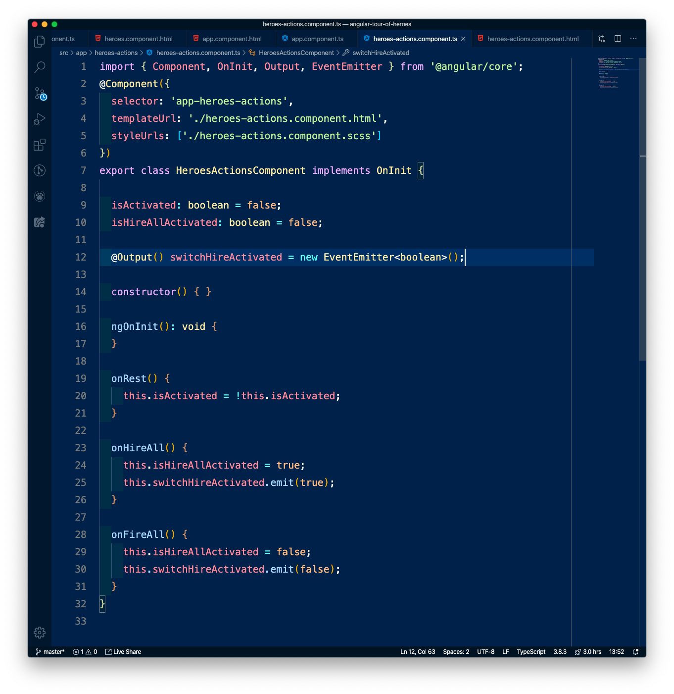

1. (l.1) on importe `EventEmitter`
2. (l.12) on créée notre attribut "output" : c'est un objet `EventEmitter`, un émetteur d'évènement ! En effet, nous voulons que l'enfant envoie un évènement. Nommons-le `switchHireActivated` (puisque l'évènement va écouter un changement sur `isHireAllActivated`)
3. (l.25) et (l.30) en plus de changer l'attribut, on demande à notre `EventEmitter` (accessible  par `this.switchHireActivated`) d'émettre une donnée: `true` ou `false`

### Côté parent (`app-root`)

Nous allons modifier dans le HTML de notre component la manière d'appeler l'enfant `app-heroes-actions` : on s'attend à ce que l'enfant, déclaré dans le HTML, envoie une donnée au Typescript, on ajoute donc un Event Binding (avec des parenthèses) contenant l'évènement envoyé par l'enfant, c'est à dire `switchHireActivated`.

En réaction à cet event binding, on attache une méthode qui sera activée quand l'évènement est écouté : `onSwitchHireActivated()`. Cette méthode prend en paramètres la valeur de l'évènement envoyé, accessible par `$event`.

Ce qui nous donne `(switchHireActivated)=onSwitchHireActivated($event)` !


Enfin, nous allons déclarer cette méthode dans le Typescript, donc dans `app.component.ts`. Pour le moment, la méthode ne fait pas grand chose à part afficher en `console.log` la valeur qui a été changée dans le composant enfant !

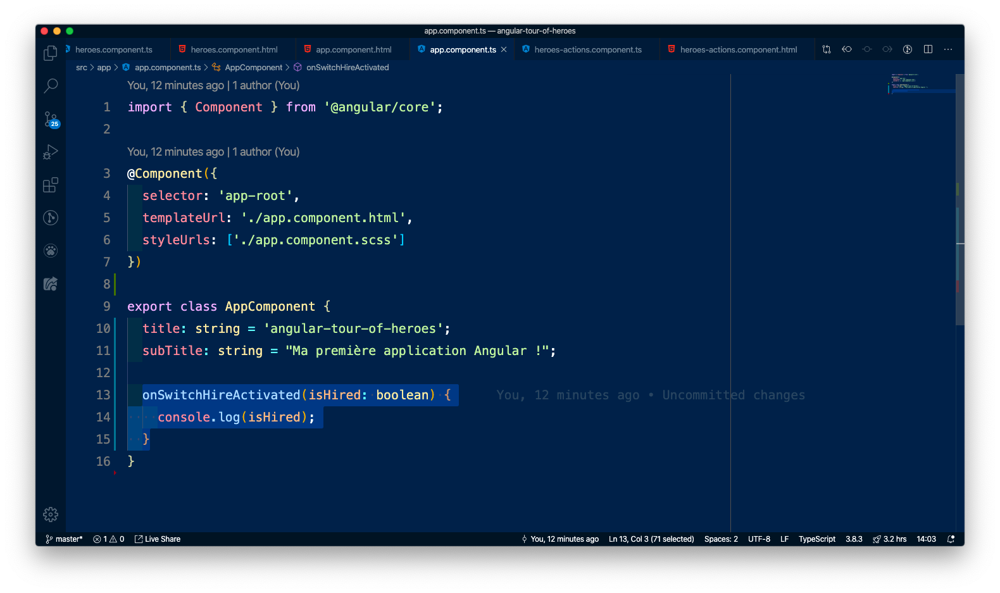

Et voilà, on a réussi à transmettre une donnée d'enfant à parent grâce à un émetteur d'évènements.

#### En résumé
Pour passer une variable d'un composant enfant (`heroes-actions`) à un composant parent `root` :

1. Dans le TS du composant enfant, on déclare un attribut qui va contenir la donnée que l'on veut transmettre. Elle sera émise par un émetteur d'évènements : `@Output() donneTransmise = new EventEmitter<TypeDeDonneTransmise>();`
2. Dans le HTML composant parent, on appelle notre composant enfant en lui écoutant l'évènement qui peut être transmis, et en l'attachant à une méthode qui gèrera cet évènement : `<app-heroes-actions (donneTransmise)="onDonneeTransmise($event)"></app-heroes-actions>`
3. On créée la méthode `onDonneeTransmise(data: TypeDeDonnee)` pour gérer cette donnée reçue par le parent !

- Faites l'[exercice 16](exercices.md#exercice-16).
