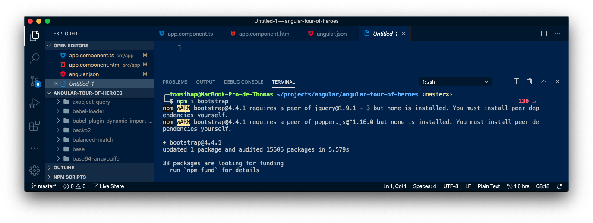
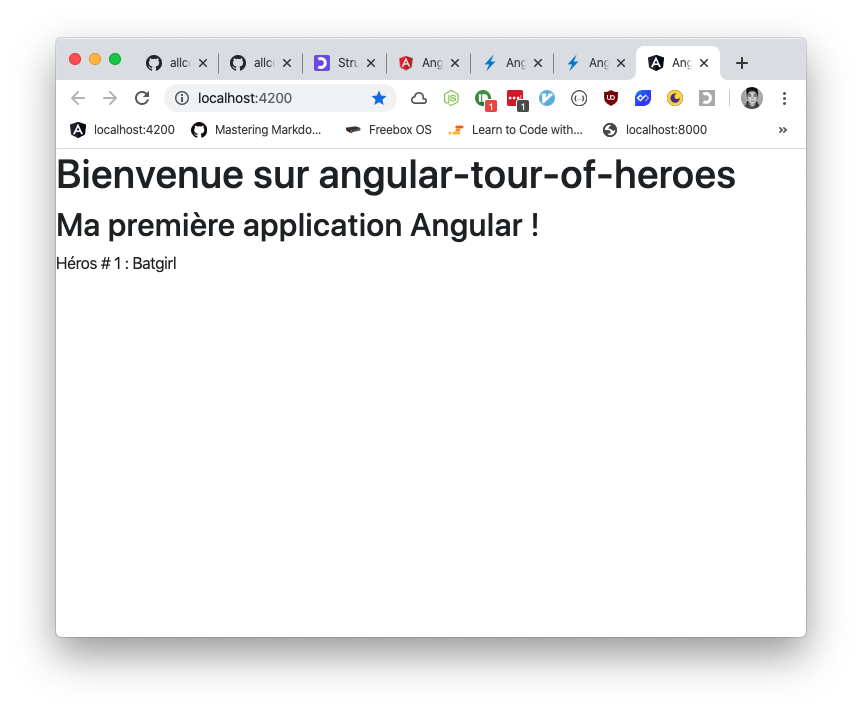
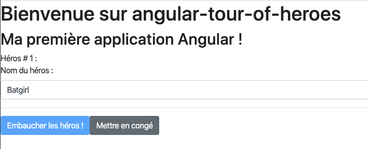
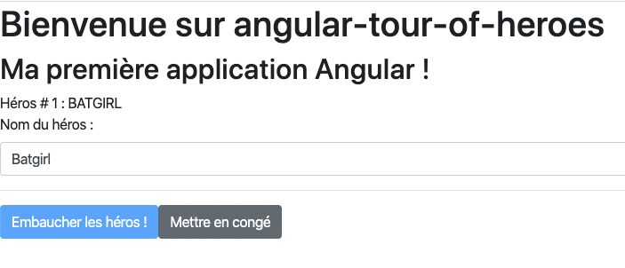
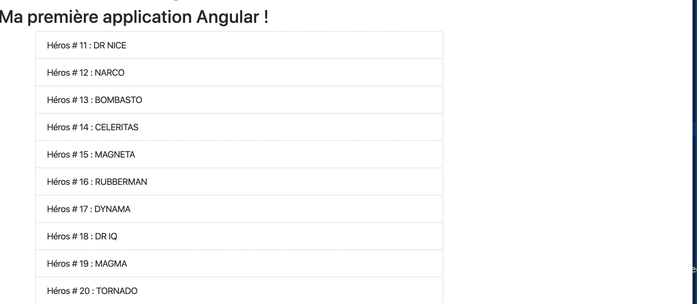
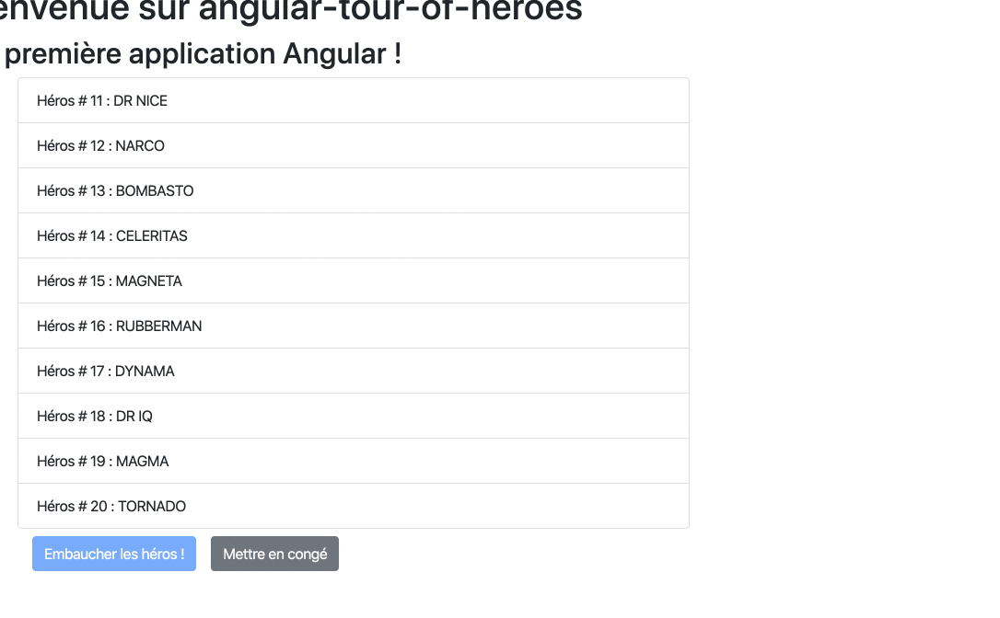
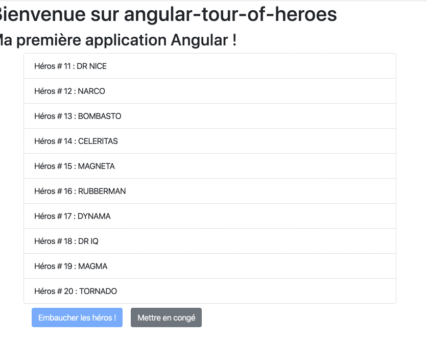
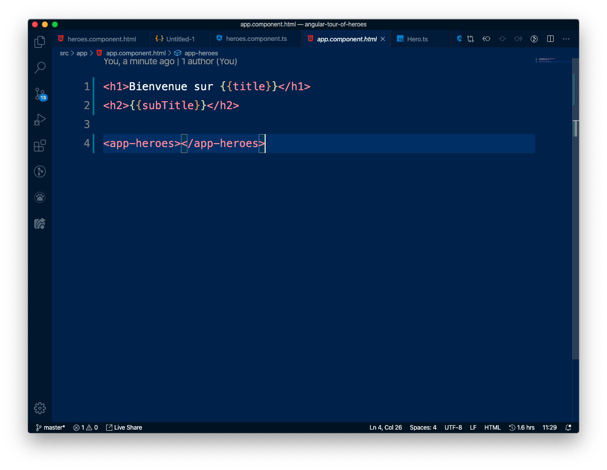

# Angular 9 : Découverte de Angular - Exercices
> - [Retourner à la liste des cours](../readme.md)
> - Cours : [cliquez-ici](01.md)
> - Corrections : [cliquez-ici](corrections.md)

---
### Exercice 1
> [Lien vers la correction](corrections.md#correction-1)
- Modifiez ce nouveau composant (et non pas le fichier `app.component.html`) pour afficher à la place une liste de tâches :


--- 

---
### Exercice 2
> [Lien vers la correction](corrections.md#correction-2)
- Créez un composant `task`, qui ne contiendra qu'une seule tâche, et ajoutez le plusieurs fois dans votre composant `tasks-list` afin d'avoir plusieurs tâches issues du component `task` :


---

---
### Exercice 3
> [Lien vers la correction](corrections.md#correction-3)
- Ouvrez un terminal dans le dossier de vos projets
- Créez un nouveau projet nommé `angular-tour-of-heroes`, sans options. Acceptez le routing Angular lorsque demandé et choisissez SCSS lorsque demandé
- Ouvrez le projet dans VSCode
- Lancez le serveur Angular
---

---
### Exercice 4
> [Lien vers la correction](corrections.md#correction-4)

- Trouvez où se situe le titre du component `app.component` et modifiez-le en `Tour of Heroes`.
- Ajoutez un type `string` aux attributs : `title` et `subTitle`.
---

---
### Exercice 5
> [Lien vers la correction](corrections.md#correction-5)

- Ajoutez Bootstrap au projet Tour of Heroes.
- Lisez les warning `WARN` affichés lors de l'installation et essayez de les résoudre : 

- Une fois résolus, saisissez `npm update` pour valider l'installation de Bootstrap
---


---
### Exercice 6
> [Lien vers la correction](corrections.md#correction-6)

- Créez un component `heroes`.
- Importez ce component dans `app.component.html`.
- Dans votre component `heroes`, ajoutez un attribut `hero` de type `string` avec pour valeur le nom de héros de votre choix.
- Affichez ce nom de héros dans la partie HTML du component.


---

---
### Exercice 7
> [Lien vers la correction](corrections.md#correction-7)

- Créez un fichier `src/app/Hero.ts` et créez une interface qui contiendra les attributs `id` (de type `number`) et `name` (de type `string`).

- Importez  l'interface dans le component `app-hero`

- Remplacez le `hero` existant par un objet de type `Hero` (avec id=1)

---


---
### Exercice 8
> [Lien vers la correction](corrections.md#correction-8)

- Affichez les données du héros créé dans le component :



---


---
### Exercice 9
> [Lien vers la correction](corrections.md#correction-9)

- Créez un bouton "mettre en congé" qui, une fois cliqué, active le bouton "embaucher les héros !" :


Les étapes à suivre sont :
1. Créer un bouton "Mettre en congé"
2. Ajouter un Event Binding qui écoute le clic sur le bouton
3. Quand on clique sur le bouton, activer une méthode
4. Dans la méthode, modifier la valeur de `isActivated` sur son inverse (soit true, soit false)

> Comment accéder à `isActivated` ? Quand on est dans une classe, on accède ou modifie ses propres attributs et méthodes avec `this.attribut` ou `this.method()`. Par exemple :

```js
class Hello() {
    name: string = "Thomas";

    sayHello() {
        console.log( "Hello" + this.name ) !
    }
}
```

---


---
### Exercice 10
> [Lien vers la correction](corrections.md#correction-10)

- Affichez le nom du héros dans un champ de formulaire.



---

---
### Exercice 11
> [Lien vers la correction](corrections.md#correction-11)

Trouvez un moyen d'afficher le nom du héros systématiquement en majuscules grâce aux Pipes de Angular ([voir la documentation](https://angular.io/guide/pipes)).



---

---
### Exercice 12
> [Lien vers la correction](corrections.md#correction-12)

Si le nom du héros est vide, affichez sa ligne en rouge une fois que l'on clique ailleurs (classe : `list-group-item-danger` sur le `li`) :



Étapes à suivre:
- Trouvez à quel endroit ajouter la classe
- Trouvez la condition à laquelle ajouter la classe

---

---
### Exercice 13
> [Lien vers la correction](corrections.md#correction-13)

Si on clique sur "Embaucher les héros !", passer tous les héros en vert (classe: `list-group-item-success`).



Étapes à suivre:
- Écouter l'évènement `click` sur le bouton
- Le rattacher à une méthode
- Créer un nouvel attribut dans le component faux par défaut
- Faire en sorte que la méthode passe cet attribut sur vrai lorsqu'elle est appelée
- Si cet attribut est sur vrai, alors mettre la classe correspondante dans les `li`

---

---
### Exercice 14
> [Lien vers la correction](corrections.md#correction-14)

- Si on clique sur "Embaucher les héros !", changer le bouton en "Virer les héros !"
- Si on clique sur "Virer les héros !" faire en  sorte qu'ils ne soient plus verts.



Étapes à suivre:
- Ajouter une directive afin d'afficher le bouton dans un cas seulement
- Créer un autre bouton qui s'affichera dans le cas inverse
- Rattacher ce second bouton à une action qui fera l'inverse de ce que fait le premier bouton ! (le premier "embauche", le second "vire")
---


---
### Exercice 15
> [Lien vers la correction](corrections.md#correction-15)

- Créez les composants suivants :
```
hero
hero-detail 
heroes-actions
```

- Intégrez les composants entre eux aux bons endroits pour respecter cette arborescence :

```
app-root : racine de notre projet
    heroes : liste des héros
        hero: un seul héros
        hero-detail : détail d'un héros
    heroes-actions: boutons d'actions
```

> Par exemple, nous avions déjà ajouté `app-heroes` (le `heroes.component` à `app-root` (le `app.component`) de la façon suivante :




---


---
### Exercice 16
> [Lien vers la correction](corrections.md#correction-16)

- Maintenant que vous avez envoyé le changement "Embaucher les héros" / "Virer les héros" depuis l'enfant `app-heroes-actions` vers le parent `app-root`, utilisez cette donnée pour l'envoyer à l'autre enfant `app-heroes`, de sorte à ce que `app-heroes` change les couleurs des héros quand ils sont embauchés comme avant !


---

---
### Exercice *
> [Lien vers la correction](corrections.md#correction-*)


---