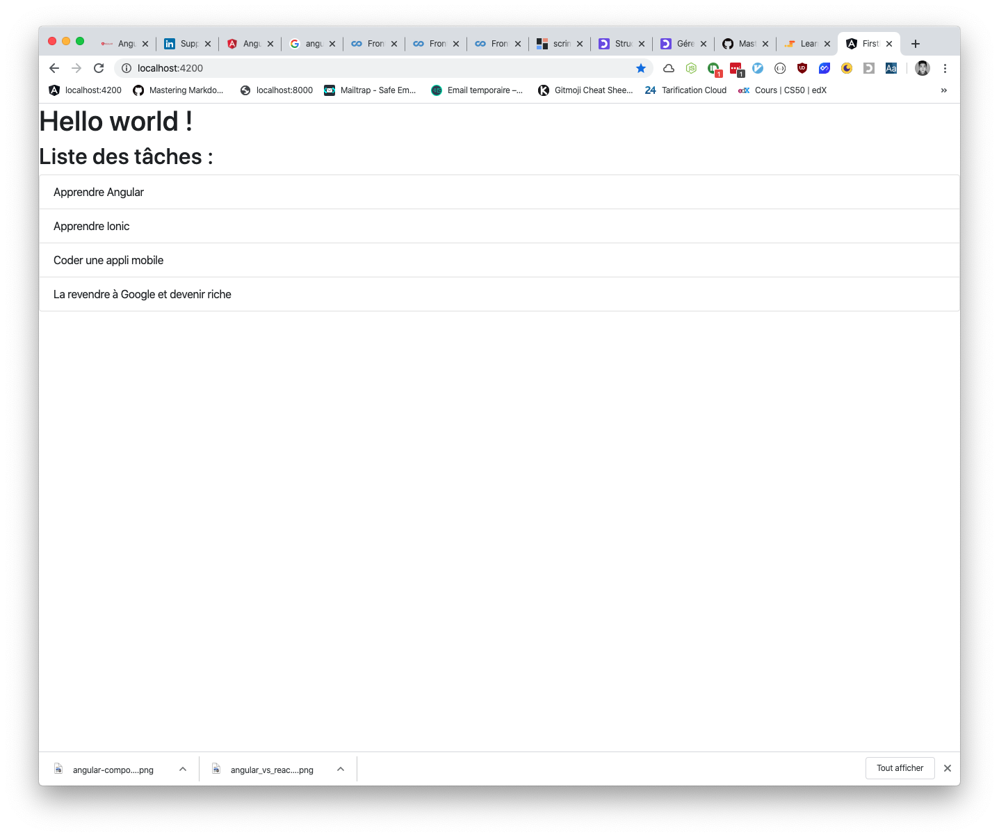
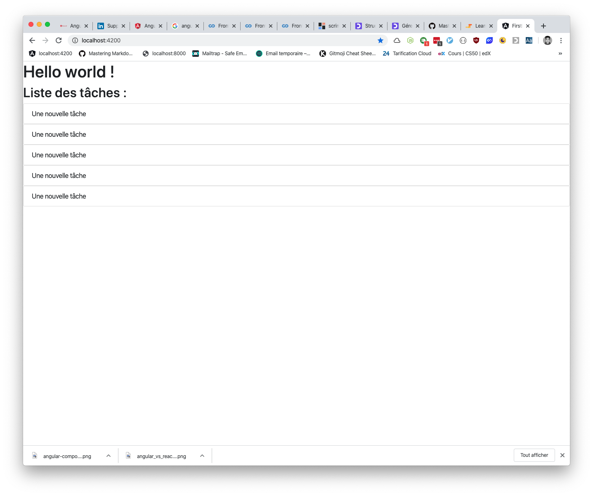

# Angular 9 : Découverte de Angular - Exercices
> - Cours : [cliquez-ici](01.md)
> - Corrections : [cliquez-ici](corrections.md)

---
### Exercice 1
> Modifiez ce nouveau composant (et non pas le fichier `app.component.html`) pour afficher à la place une liste de tâches :

--- 

---
### Exercice 2
> Créez un composant `task`, qui ne contiendra qu'une seule tâche, et ajoutez le plusieurs fois dans votre composant `tasks-list` afin d'avoir plusieurs tâches issues du component `task` :

---