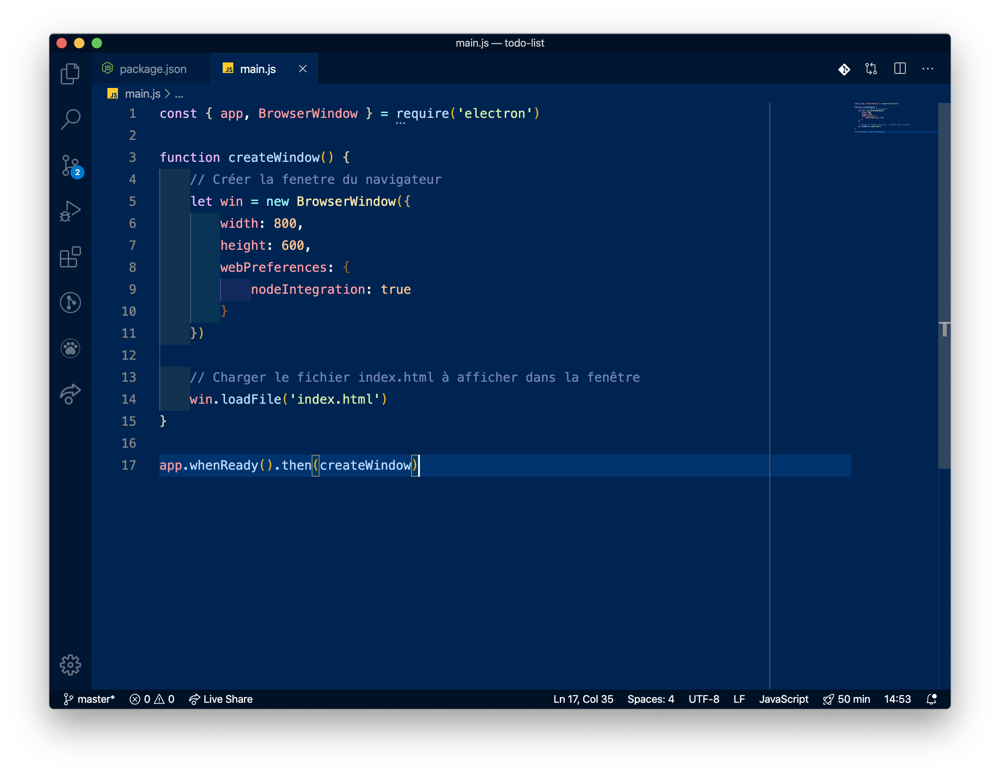
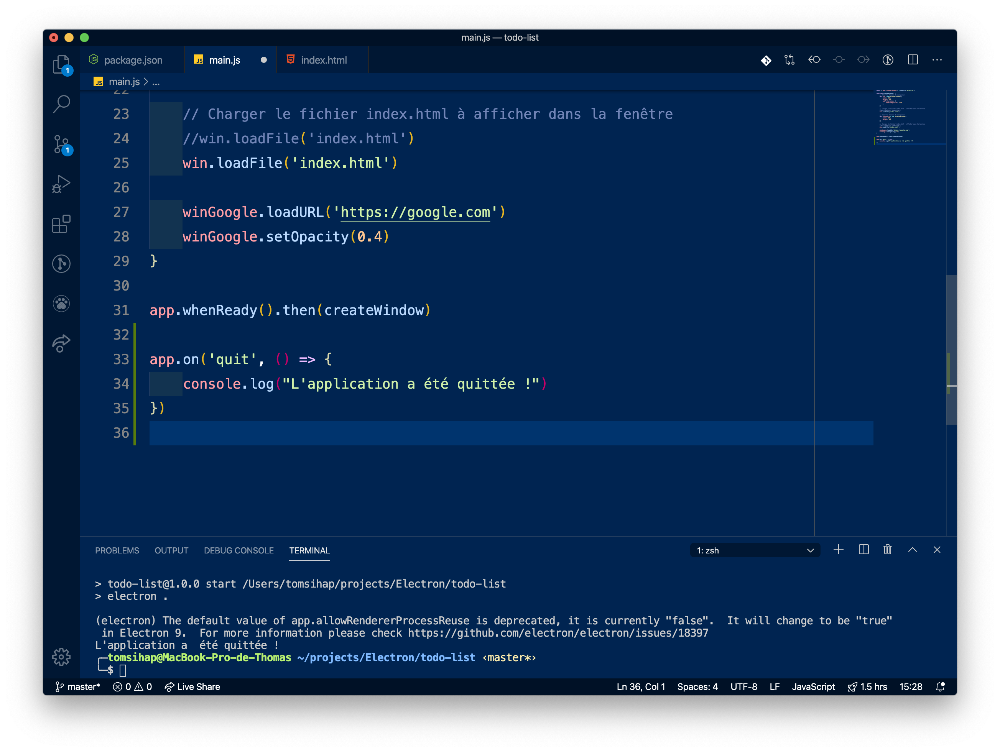
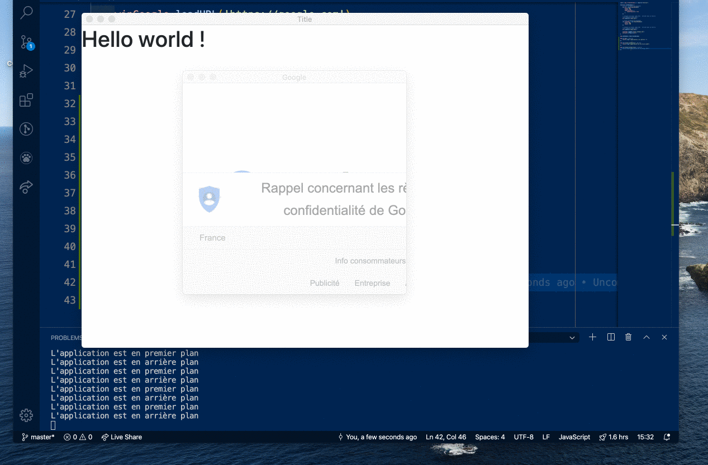
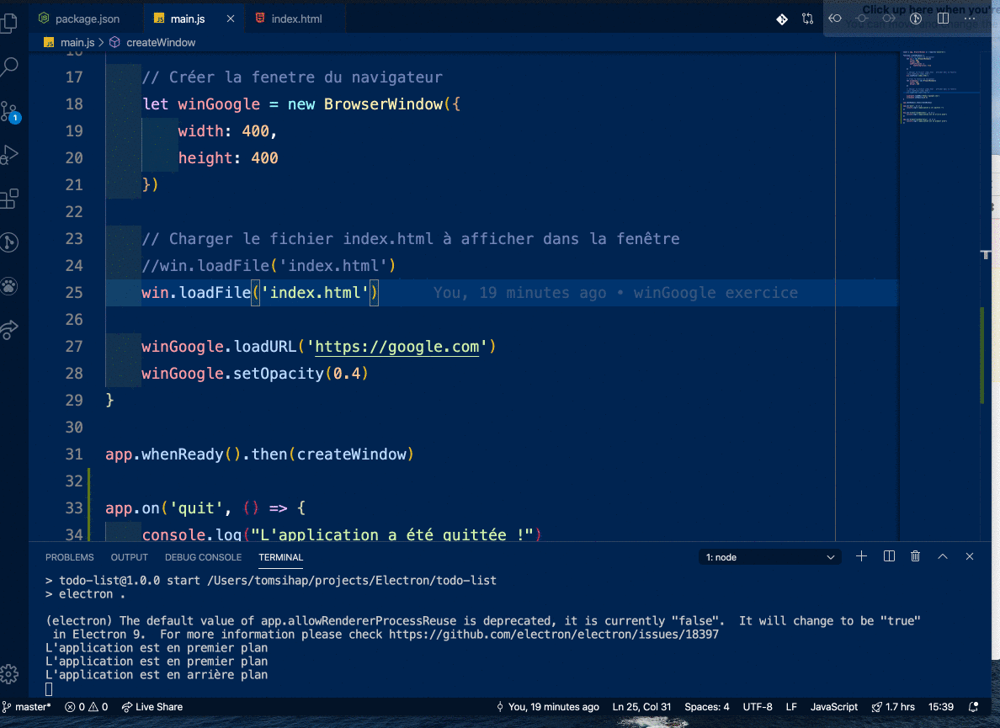
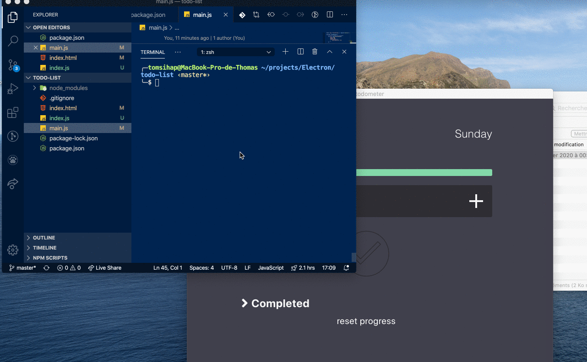
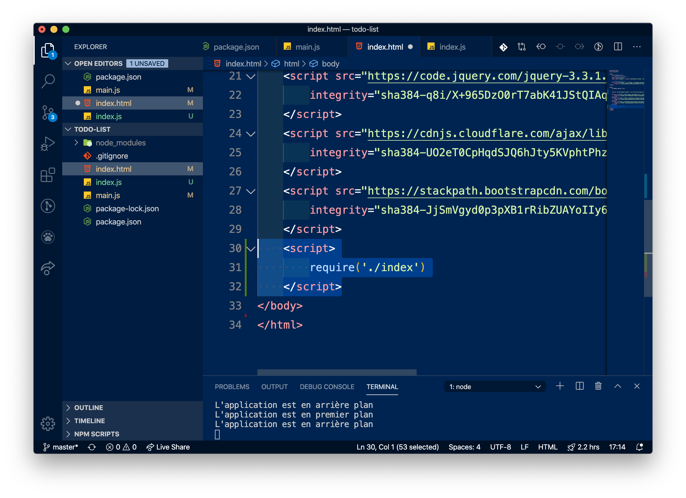
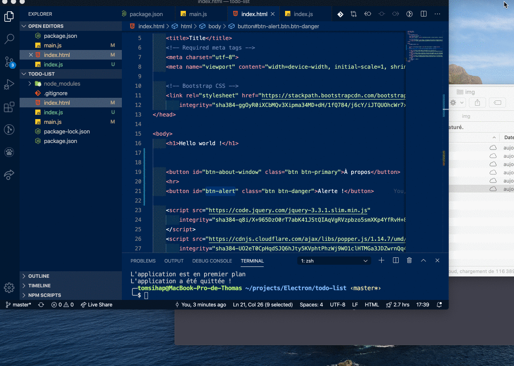
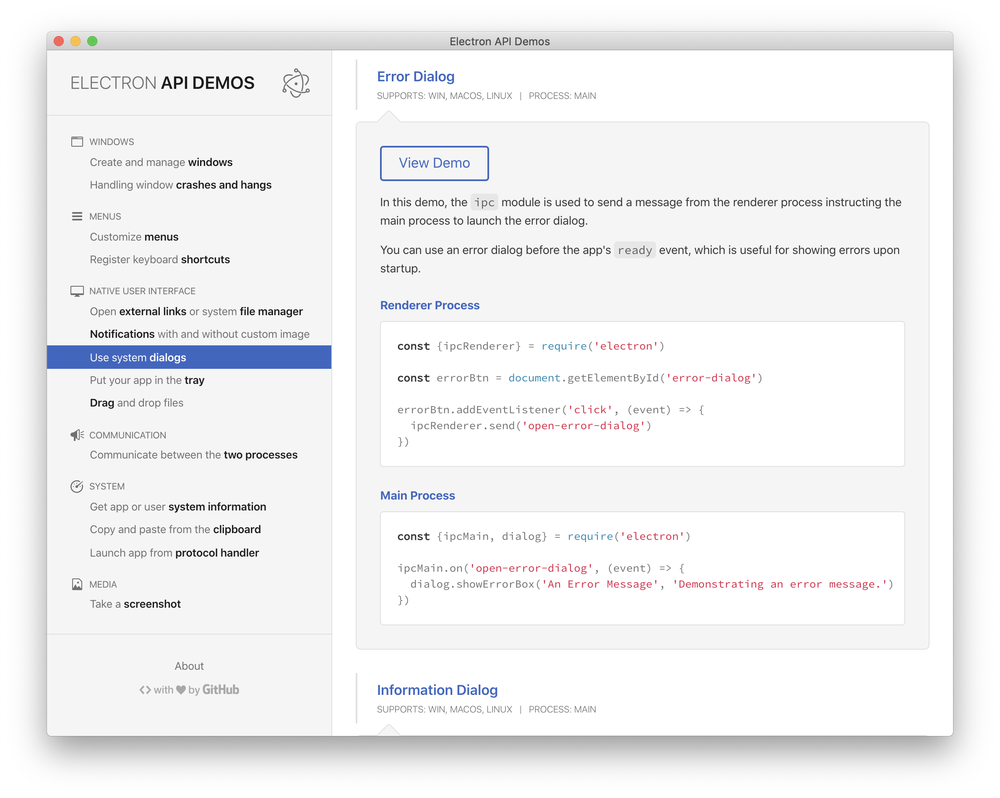

# Electron JS 1 - Première application, electron.app et BrowserWindow

> - [Site officiel](https://www.electronjs.org/)


- [Electron JS 1 - Première application, electron.app et BrowserWindow](#electron-js-1---premi%c3%a8re-application-electronapp-et-browserwindow)
  - [Mise en place de l'environnement](#mise-en-place-de-lenvironnement)
  - [De quoi est capable Electron ?](#de-quoi-est-capable-electron)
  - [Créer votre première App](#cr%c3%a9er-votre-premi%c3%a8re-app)
  - [Installer Electron](#installer-electron)
  - [Le développement avec Electron](#le-d%c3%a9veloppement-avec-electron)
    - [Fichier `main.js`](#fichier-mainjs)
    - [Fichier `index.html`](#fichier-indexhtml)
    - [Tester l'application](#tester-lapplication)
    - [Exercice `winGoogle`](#exercice-wingoogle)
  - [Gérer les états de l'application avec `electron.app`](#g%c3%a9rer-les-%c3%a9tats-de-lapplication-avec-electronapp)
    - [Exercice : fenêtre en focus](#exercice--fen%c3%aatre-en-focus)
  - [Utiliser les DevTools](#utiliser-les-devtools)
  - [Renderer Process, Javascript et Electron](#renderer-process-javascript-et-electron)
    - [Les étapes](#les-%c3%a9tapes)
    - [Exercice](#exercice)
  - [Exercice : communiquer entre process](#exercice--communiquer-entre-process)

> Electron vous permet le développement d'applications desktop, c'est à dire des logiciels à lancer directement depuis le système d'exploitation... En utilisant les langages du web ! Vous pourrez créer un logiciel grâce à HTML, CSS et Javascript.

Les avantages d'une application Electron sont :

- pas de soucis de développement cross-browser : les applications tournent sous le navigateur Chromium inclus
- pas de soucis de développement cross-platform : les applications fonctionnent nativement sous OSX, Linux et Windows
- vous pouvez faire tourner une application en local et sans connexion, à la différence d'un site web dépendant d'une connexion Internet
- l'accès au système de fichiers est limité avec une application web
- l'utilisation de technologies du Web permet de profiter d'une communauté de développeurs très conséquente et d'un énorme ensemble d'outils, que l'on utilise aussi pour le web !

Une application Electron est composée des technologies suivantes :

- *HTML* et *CSS* pour l'affichage (UI)
- *npm* pour la gestion des dépendances du projet (c'est à dire, les outils et librairies nécessaires au lancement du projet)
- *node.js*, une technologie permettant de faire du développement back-end (côté serveur) en Javascript
- *Chromium*, un navigateur web léger open-source, dans lequel votre application sera lancée

Des exemples d'applications codées avec Electron :
- VSCode
- Atom
- Slack
- Discord
- Skype
- Wordpress Desktop
- WhatsApp Desktop
- [Windows 95 !](https://www.omgubuntu.co.uk/2018/08/windows-95-electron-app)

> Pour ce cours, nous suivrons les pages de la [documentation officielle](https://www.electronjs.org/docs/).

## Mise en place de l'environnement
> Documentation: https://www.electronjs.org/docs/tutorial/development-environment

Téléchargez et installez Node.js [en cliquant ici](https://nodejs.org/en/download/). Le programme installera aussi npm.

Quel que soit votre système d'exploitation, vous pourrez tester que l'installation fonctionne en ouvrant un terminal et en saisissant :

```bash
# Commande pour vérifier la version de Node.js
node -v

# Commande pour vérifier la version de NPM
npm -v
```

> *Note* : quand vous installez un logiciel en ligne de commande, lancez systématiquement un nouveau terminal et saisissez la commande permettant de vérifier la version (la commande peut varier : `programme -v`, `programme --version`, `programme version`; ...). Si la commande fonctionne, c'est que le logiciel est installé sur votre système  !

## De quoi est capable Electron ?

- Téléchargez la dernière version du projet `electron-api-demos` pour la plateforme de votre choix [en cliquant ici](https://github.com/electron/electron-api-demos/releases).


## Créer votre première App
> Documentation : https://www.electronjs.org/docs/tutorial/first-app

La structure de base d'une application Electron est la suivante :

```bash
votre-app/          # Dossier du projet
├── package.json    # Liste des dépendances du projet (par exemple: Electron !)
├── main.js         # Le fichier d'entrée de l'application
└── index.html      # Le HTML de la première "fenêtre" de l'application
```

1. Créez un nouveau dossier de projet `todo-list`
2. Ouvrez **ce dossier** (et pas un dossier parent ou autre!) dans VSCode
3. Créez le fichier `package.json` et remplissez-le ainsi :

```json
{
  "name": "todo-list",
  "version": "1.0.0",
  "description": "First Electron App !",
  "main": "main.js",
  "scripts": {
    "start": "electron ."
  }
}
```

> *Note:* le `package.json` sert de "carte d'identité" de notre projet. On y renseigne des éléments déclaratifs (nom du projet, description, auteur, licence...), des éléments plus techniques comme des scripts automatisés, ainsi -et surtout- la liste des dépendances du projet. Notre projet ne sait pas encore qu'il utilisera Electron, renseignons-le !

> *Note*: vous pouvez aussi saisir la commande `npm init` pour créer ce fichier avec un petit formulaire dans le terminal


## Installer Electron

Ouvrez un terminal dans VS Code et saisissez :

```bash
npm install --save-dev electron
```

## Le développement avec Electron

### Fichier `main.js`

Ce  fichier permet de créer les fenêtres de l'application et de gérer tous les évènements que l'application peut rencontrer (demande de droits, gestion de fichiers...).

> *Note* : Electron permet l'utilisation des APIs Node.js (c'est à dire, de tous les outils fournis par Node.js)

- Créez un fichier `main.js` dans le projet et remplissez-le ainsi :



- `l.1` : cette instruction `require` permet de piocher dans la librairie `electron` les outils `app` et `BrowserWindow`. 
- `l.3` :  nous créons une fonction qui sera appelée au démarrage de l'application. En l'occurence, elle crééra une simple fenêtre !
- `l.5` : on se sert de l'outil `BrowserWindow` (c'est en fait une *classe*) qui nous permet de créer la fenêtre. On la stocke dans la variable `win`.
- `l.14` : on indique à notre fenêtre, dans `win`, de charger le fichier `index.html` pour gérer son contenu
- `l.17` : l'outil `app` nous permet de gérer l'application dans son ensemble, ses états (en chargement, prête, ouverte...). Ici, on dit que quand l'application est lancée, on appelle la fonction `createWindow()`.


### Fichier `index.html`

- Créez un fichier `index.html` avec du code Bootstrap de base (vous pouvez utiliser le [Starter Template](https://getbootstrap.com/docs/4.4/getting-started/introduction/#starter-template)) et écrivez dans un `h1` "Hello world !".

### Tester l'application
- Ouvrez un terminal dans VSCode et saisissez `npm start` : une fenêtre devrait s'ouvrir. C'est notre première application Electron !

- Pour quitter le script `npm`, deux solutions : soit vous fermez la fenêtre Electron, soit vous saisissez `ctrl+c` dans le terminal.

### Exercice `winGoogle`
> Documentation : [BrowserWindow](https://www.electronjs.org/docs/api/browser-window)

1. Dans la fonction `createWindow()`, créez une seconde fenêtre nommée `winGoogle` de taille `400*400`.
2. Plutôt que d'afficher une page web comme `index.html`, elle devra afficher la page `https://google.com`.
3. Réglez l'opacité de cette fenêtre sur la valeur `0.4`.

> Vous pouvez compléter votre code avec des instructions propres à MacOS en reprennant le code de la documentation officielle : https://www.electronjs.org/docs/tutorial/first-app#le-d%C3%A9veloppement-avec-electron-en-r%C3%A9sum%C3%A9

## Gérer les états de l'application avec `electron.app`

> Documentation : [electron.app](https://www.electronjs.org/docs/api/app)

Comme on l'a vu, `app` est une variable qui va nous permettre de gérer les différents états de l'application. Par exemple, en rajoutant à la fin de `main.js` le code suivant `app.on('quit', ...` :



- On utilise `app`
- On écoute un évènement avec `on`
- L'évènement est : `quit` (quand on quitte l'application)
- On déclanche une fonction fléchée  `() => { /* instructions */ }` dans laquelle on mettra le code qui se produira lorsque l'on quitte l'application
- `console.log("L'application a été quittée !")` : ce console.log s'affiche dans le terminal VSCode !

Lancez puis quittez l'application et vérifiez si le console.log s'affiche.

### Exercice : fenêtre en focus

- Ajoutez un évènement qui se déclanche quand la fenêtre est au premier plan.
- Ajoutez un évènement qui se déclanche quand la fenêtre n'est plus au premier plan.
- Dans les deux cas, ajoutez un `console.log()` qui annonce "L'application est en premier plan" ou "L'application est en arrière plan" en fonction du focus.

> Note: pour être en focus, il suffit de cliquer dans l'application. Pour ne plus être en focus, il suffit de cliquer en dehors de l'application.



## Utiliser les DevTools
> Documentation: https://www.electronjs.org/docs/api/web-contents

Comme notre application Electron utilise Chromium, un navigateur web basé sur Chrome, nous avons accès à des DevTools pour pouvoir débuguer l'application.

Vous pouvez ouvrir les DevTools en allant dans la barre de menu puis `View > Toggle Developer Tools`, ou vous pouvez dire dans le code d'ouvrir systématiquement les DevTools.

On veut ouvrir les DevTools pour notre fenêtre principale, `win`. On va saisir la ligne suivante :

```js
win.webContents.openDevTools()
```



## Renderer Process, Javascript et Electron

> Dans cet exercice, vous allez créer un bouton permettant d'ouvrir une nouvelle fenêtre.



Dans Electron, on peut distinguer plusieurs processus qui agissent en parallèle :
- main.js, le *processus principal*, qui créée des pages grâce à `BrowserWindow`.
- les *renderer process*, ce sont des process qui appartiennent à chacune des pages.

On peut imaginer cette structure comme : `main.js` étant le fichier Javascript parent, et les renderer process les fichiers Javascript enfants, appartenant aux fenêtres BrowserWindow.

Chaque process va gérer sa propre fenêtre, et ils peuvent éventuellement communiquer entre eux.

Dans cet exercice, nous allons gérer l'évènement du clic sur un bouton dans la fenêtre `win`, lequel ouvrira une nouvelle fenêtre avec `BrowserWindow`, qui  affichera la page `https://yahoo.fr`.

### Les étapes

1. Ajouter un bouton dans `index.html`
2. Créer un fichier `index.js` à la racine du projet et l'importer dans `index.html`
3. Ajouter un Event Listener dans `index.js` pour écouter le clic du bouton
4. À l'écoute du clic, créer un nouveau `BrowserWindow`


### Exercice

1. Ajoutez un bouton dans `index.html`, comme dans l'exemple. Donnez un `id` à ce bouton de sorte à pouvoir le retrouver avec Javascript.

2. Créez le fichier `index.js`, qui sera le Javascript dédié à notre page `index.html`. Importez ce fichier dans `index.html` de la façon suivante :



> Vous remarquerez que nous n'importons pas avec `<script src>` mais avec `require` ! C'est la façon des projets fonctionnant autour de node.js d'importer les fichiers.

> De plus, remarquez qu'il n'y a pas de `.js` dans le nom du fichier lorsqu'on le met dans `require` : en effet, quand on `require` un fichier, c'est forcément un fichier `js`. Ainsi, `require` nous permet l'économie de quelques caractères... et surtout une meilleure lisibilité du code quand on a beaucoup de fichiers à importer.

3. Dans `index.js` : déclarez une constante `newWindowBtn`, qui correspond à votre bouton dans le DOM (récupérez le comme vous faites habituellement en JS).

4. À cette constante, ajoutez un Event Listener qui écoute l'évènement `click`.

5. En réponse à cet évènement, faites une `alert()` affichant : "Le bouton a été cliqué !"

6. Maintenant que votre évènement fonctionne, plutôt qu'une alerte, vous voulez ouvrir une nouvelle fenêtre ! Pour cela, il faudra utiliser `BrowserWindow`. Il faut donc importer cette classe. Pour cela, ajoutez en première ligne de votre fichier :

```js
const {BrowserWindow} = require('electron').remote
```

7. Vous pouvez dorénavant dans l'action de l'Event Listener créer une fenêtre: 
   1. Créez la fenêtre dans une variable nommée `winYahoo` grâce à `new BrowserWindow`
   2. Déclarez l'URL à afficher dans la nouvelle fenêtre
   3. Finissez par `winYahoo.show()` pour vous assurer que la nouvelle fenêtre s'affiche au premier plan

## Exercice : communiquer entre process

Nous allons voir comment ouvrir un pop-up de message d'erreur !




> - Nous allons transmettre une donnée d'un process à un autre. 
> - En effet, le process qui gère l'affichage des pop-up d'erreur est le Main Process, c'est à dire le process principal. C'est une fonctionnalité critique et qui incombe à l'ensemble de l'application, c'est pour cela que le Main Process s'en occupe.
> - Par contre, l'évènement déclancheur vient d'un Renderer Process, le process enfant qui gère la fenêtre affichant `index.html`. 

> - Nous allons apprendre à transmettre une donnée d'un renderer process jusqu'au main process !

Exercice : 
- En utilisant l'exemple du projet `electron-api-demos` (dans la rubrique `Native User Interface > Use System Dialogs`), créez un bouton "Alerte !" qui ouvrira un pop-up d'erreur : "Vous avez lancé une alerte !"

Ci-dessous: l'exemple de l'application `electron-api-demos` :

