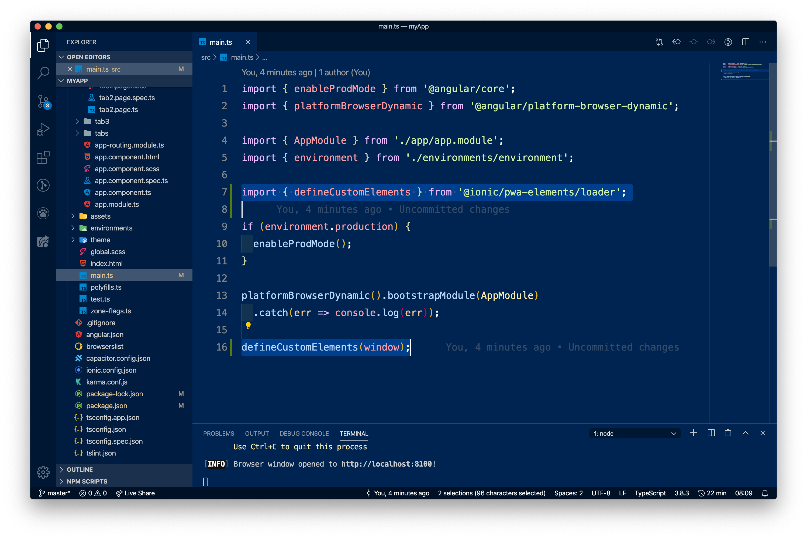
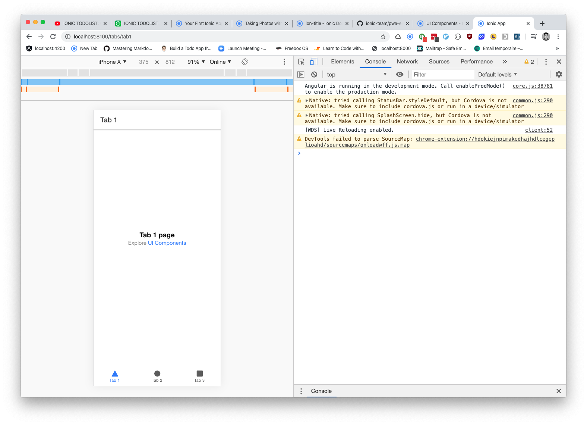
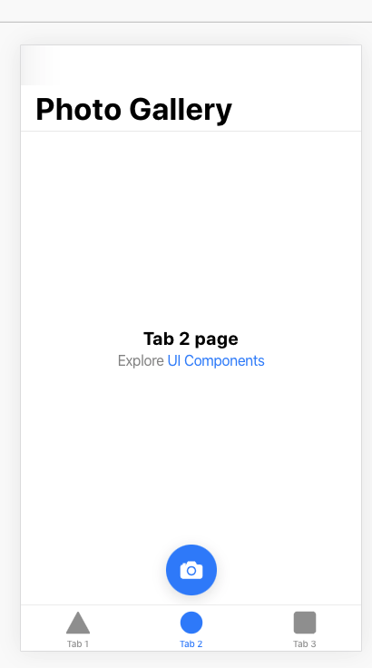
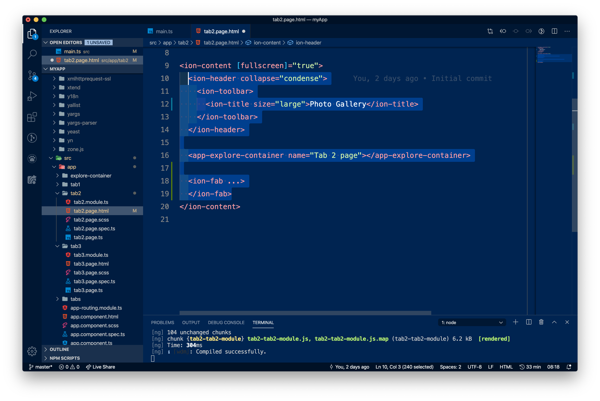
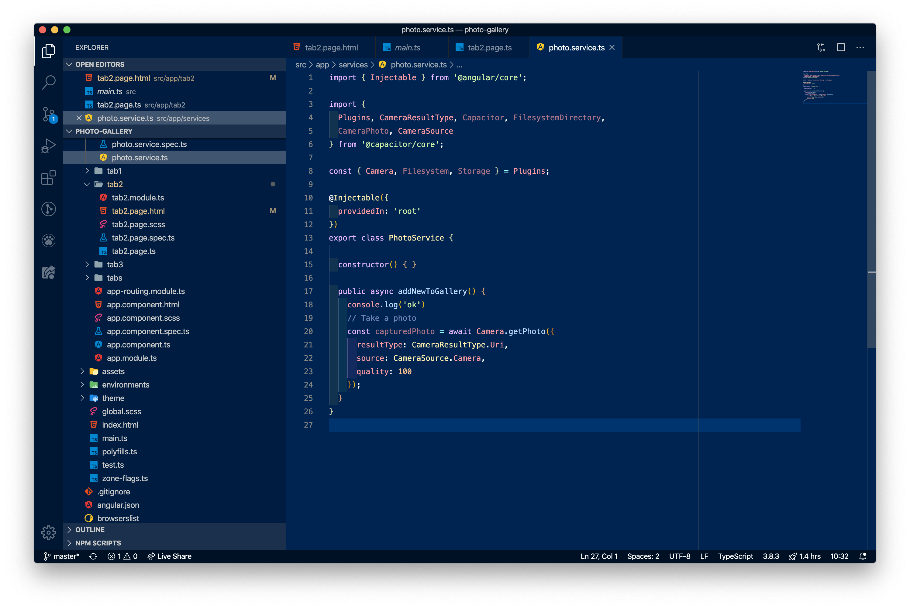

# Ionic 6 - Partie 1 : Découverte de Ionic
> - [Retourner à la liste des cours](../readme.md)
> - Exercices : [cliquez-ici](exercices.md)
> - Corrections : [cliquez-ici](corrections.md)

- [Ionic 6 - Partie 1 : Découverte de Ionic](#ionic-6---partie-1--d%c3%a9couverte-de-ionic)
  - [Ionic, Capacitor, Cordova](#ionic-capacitor-cordova)
  - [Installation de Ionic](#installation-de-ionic)
  - [Créer notre première application Ionic](#cr%c3%a9er-notre-premi%c3%a8re-application-ionic)
  - [Ouvrir le projet](#ouvrir-le-projet)
    - [Exercice 1](#exercice-1)
    - [Exercice 2](#exercice-2)
    - [Exercice 3](#exercice-3)
  - [Gérer la logique avec des Services](#g%c3%a9rer-la-logique-avec-des-services)
    - [Exercice 4](#exercice-4)

> Ionic est un framework vous permettant de développer des applications mobiles multi-plateforme. Développé sur Angular, il vous permet d'utiliser Typescript et vos connaissances en Angular pour créer une application qui pourra être publiée pour Android ou iOS par exemple !

La création d'applications mobiles passe par deux méthodes principales :
- utiliser les langages natifs (Swift et Objective-C pour iOS, Java pour Android, C# pour les anciens Windows Phone...)
- utiliser un framework qui vous permet de coder dans un langage du web, par exemple en structurant en HTML/CSS et en créant la logique en Javascript

Utiliser des langages natifs permet d'avoir une application plus optimisée, d'utiliser les technologies les plus récentes proposées par les constructeurs, néanmoins ils requièrent d'apprendre un nouveau langage et pour de très nombreux cas, nous n'avons pas besoin d'autant de fonctonnalités. De plus, il va falloir coder l'application deux fois, une fois pour iOS, une fois pour Android.

Utiliser les langages du web pour faire une application permet d'avoir la même base de code pour tous les appareils ! Par exemple, lorsque vous voudrez utiliser l'appareil photo, vous le direz à la manière de Ionic qui se chargera lors de la compilation de convertir votre code en un appel natif à l'appareil photo côté iOS pour la version AppStore, et côté Android pour la version Play Store. Le désavantage, c'est que vous n'avez pas accès aux fonctionnalités les plus poussées ou trop propres à un appareil en particulier. De plus, votre code ne pourra pas être aussi optimisé que si vous l'aviez codé en langage natif.

C'est un peu comme utiliser un créateur de sites web en ligne pour faire son site : c'est très rapide et pratique, on a accès à la plupart des fonctionnalités communes aux sites Internet, néanmoins il sera impossible d'utiliser des fonctionnalités très avancées.

Notez cependant, les limites de Ionic sont nettement plus élevées ! On se servira d'un langage natif plutôt lorsque vous aurez besoin de ressources machines optimales (jeux vidéos, machine learning...).

Il existe des alternatives à Ionic, notamment React Native. React Native se base sur le même fonctionnement que React, mais utilise son propre langage de rendu plutôt que HTML/CSS. Le code compilé est natif là où Ionic compile un "site web mobile" : les applications React sont dont plus optimisées mais les applications Ionic sont plus rapides à développer et à mettre en page.

## Ionic, Capacitor, Cordova

Ionic est le framework qui va nous permettre de composer notre application : il nous fournit tous les outils de templating, routage... nécessaires à coder avec du code Angular ou React.

Cordova et Capacitor sont la surcouche matérielle qui va nous permettre d'utiliser les éléments plus "physiques" de l'appareil (capteur de mouvement, de luminosité, microphone, caméra, gyroscope...)

## Installation de Ionic

Tout comme Angular, Ionic a besoin de NPM pour être installé. Vérifiez que Node et NPM soient bien installés (`node -v`, `npm -v`) puis installez globalement Ionic :

```bash
npm install -g @ionic/cli native-run cordova-res
```
- `native-run` sert à lancer des exécutables iOS/Android
- `cordova-res` contient des ressources autour de la gestion d'applications

## Créer notre première application Ionic

> Nous allons nous inspirer de l'application de démo de la documentation : une app de photos !

Ionic vient avec plusieurs "templates" d'applications basiques: 'blank' pour un projet vide mono-page, "tabs" pour avoir des tabs de navigation, "sidemenu" pour avoir une sidebar de navigation. ([doc](https://ionicframework.com/docs/developing/starting)). 

> Consultez la liste des templates existants avec `ionic start --list`

Créez une première application :

```bash
ionic start photo-gallery tabs
```

- Pick a framework: `Angular`
- Integrate your new app with Capacitor: `yes`
- Create a free Ionic account: `No` (comme vous voulez)

Le CLI Ionic permet de générer de nombreux types de fichiers:

> Consultez la liste des générateurs avec `ionic generate`

Enfin, Ionic vient avec un nombre de "UI Components" (attention, on parle ici des composants d'interface utilisateur, pas des *components* Angular) qui vous permet de structurer votre application avec des éléments communs à iOS et Android :

> Regardez la démo d'application iOS/Android sur [la page d'accueil de la doc](https://ionicframework.com/docs/)

> Documentation complète des [UI components](https://ionicframework.com/docs/components)

## Ouvrir le projet

Nous allons installer la librairie *PWA (Progressive Web App) Elements* :
> Ouvrez le projet dans VSCode
> Ouvrez un terminal et installez : `npm install @ionic/pwa-elements`

Il s'agit de plugins à Capacitor qui incluent par exemple l'API de gestion de la caméra.

Comme il s'agit d'une librairie externe, il faut bien l'importer dans le projet. Modifiez le fichier `main.ts` ainsi :



Ensuite, lancez le projet !

```
ionic serve
```

> Ouvrez les DevTools et mettez-vous en format mobile :



Ça y est, notre première application mobile est créée ! 😄

En fait, dans Ionic, tout va fonctionner en UI components comme nos tabs qui sont déjà prètes. L'avantage, c'est qu'ils prennent les standards de design de Google ou de Apple, avec le même code de base.

---

### Exercice 1
- Changez le titre du deuxième tab en allant dans le component `src/app/tab2` et remplacez-le  par "Photo Gallery"
- Il y a deux endroits dans le même fichier où il faut changer le titre !

Le titre est changé à deux endroits à cause du support d'une feature iOS dans la gestion des titres larges.

---

Ajoutons des éléments dans notre page :

---

### Exercice 2
- Ajoutez un bouton "Caméra" dans cette page Tab2. Vous pouvez trouver [la documentation ici](https://ionicframework.com/docs/api/fab). Le bouton doit être simple (comme le bouton rouge de la documentation, pas de menu quand on clique dessus) et se trouve en bas au milieu :



> Note: le code se place toujours dans `ion-content` :



---

---

### Exercice 3

- Modifiez le fichier `src/app/tabs.page.html` pour modifier le nom et  l'apparence du deuxième onglet. Vous trouverez une liste d'icônes [dans ce lien !](https://ionicons.com/)


---

## Gérer la logique avec des Services

Les services sont des classes dans lesquelles nous allons placer des morceaux de code utiles de partout dans l'application. Une méthode qui fait de la traduction, une méthode qui gère les droits utilisateurs... ou une méthode qui permet d'activer une photo : ces éléments là peuvent être potentiellement utilisés de  partout  dans le code !

Par exemple, pour les photos : plutôt que  d'écrire deux fois la méthode nous permettant de prendre une photo si nous en avions besoins dans deux *pages* (l'équivalent  des *components* Angular) nous n'allons l'écrire qu'une seule fois dans une classe "boîte à outils", que nous importerons au besoin.

Ces classes boîte à outils, ce sont les services !

> Créez un service avec `ionic g service services/photo`.

Dans ce service importez les outils suivants (ils concernent la gestion de l'appareil photo et le stockage de données) :

```ts
import { Plugins, CameraResultType, Capacitor, FilesystemDirectory, 
         CameraPhoto, CameraSource } from '@capacitor/core';

const { Camera, Filesystem, Storage } = Plugins;
```

Ensuite, ajoutez la méthode suivante : elle appelle la classe `Camera`, et la méthode `getPhoto()` de cette classe, pour prendre une photo.


```ts
public async addNewToGallery() {
  // Take a photo
  const capturedPhoto = await Camera.getPhoto({
    resultType: CameraResultType.Uri, 
    source: CameraSource.Camera, 
    quality: 100 
  });
}
```




Ensuite, importez ce service dans `tab2.page.ts` pour que notre page puisse l'utiliser :

```ts
import { PhotoService } from '../services/photo.service';
// ...
constructor(public photoService: PhotoService) { }
```


> Note: le constructor est une méthode qui est lancée au démarrage d'une classe. Ici, lorsque notre classe tabs2 est chargée par Ionic, elle s'exécute. Grâce à une technologie que nous verrons plus tard, *l'injection de dépendances*, on va venir "injecter" notre service au démarrage de l'application. Ici, nous disons que nous déclarons un attribut `photoService` qui sera de type `PhotoService` (c'est une instance de la classe PhotoService que nous venons de faire).

---

### Exercice 4

- Modifiez le bouton "photo" pour lui ajouter l'écoute du clic en event binding. L'action réalisée sera `photoService.addNewToGallery()`.

---