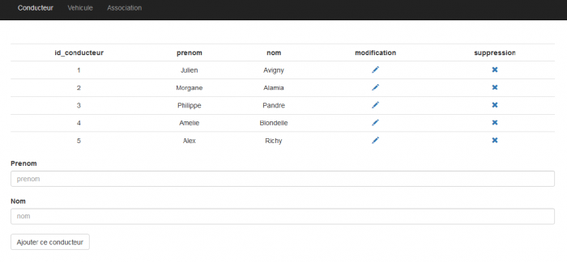
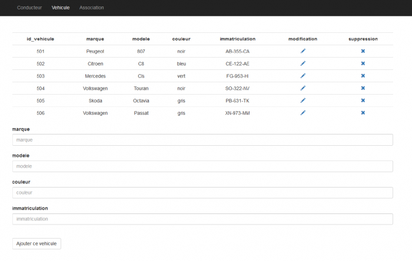
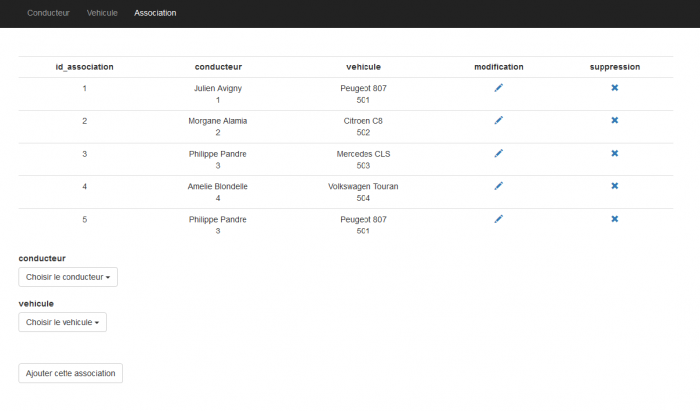

# Examen WF3 : PHP, Programmation Orientée Objet, PDO et MVC

## Notation

A la fin du temps imparti, vous devrez livrer l’intégralité de vos fichiers, et une note sur 20 sera attribuée selon le barème suivant :

- Exercice 1 : 2 points
- Exercice 2 : 2 points
- Exercice 3 : 5 points
- Exercice 4 : 5 points
- Exercice 5 : 4 points
- Exercice 6 : 2 points

## Durée

Temps imparti : 4 heures

Estimations :
- Exercice 1 : 00:10
- Exercice 2 : 00:10
- Exercice 3 : 01:20
- Exercice 4 : 01:20
- Exercice 5 : 00:40
- Exercice 6 : 00:20

## Exercice 1 (2 points) : Rendu du projet

- Créez un projet Github et hébergez le code source de votre projet.
- En utilisant les possibilités de Git, vous devrez faire en sorte que le projet sur Github **ne contienne pas** le dossier `/vendor`.
- Le projet doit contenir au moins 5 commits.
- En cas de problèmes relatifs à Git et Github, vous pourrez envoyer l'intégralité du projet **sans le dossier vendor** via Slack au formateur à la fin de l'examen.


## Exercice 2 (2 points) : Création d'une base de données

> **Attention :** Il vous sera demandé de respecter au caractère près toutes les caractéristiques et données de la base de données. En effet, le projet sera testé sur la base de données du formateur et les données doivent concorder.

1. Créez une base de données que vous appellerez « vtc ».
2. A l’intérieur de celle-ci, vous créerez trois tables que vous appellerez « conducteur », « association_vehicule_conducteur » et « vehicule » avec les champs et données ci-dessous.
3. Exportez la base de données et ses données dans un fichier `dump.sql` à la racine de votre projet.

```
Table : conducteur
Champs :
- id_conducteur  (PK – AI – INT)
- prenom (VARCHAR)
- nom (VARCHAR)

Table : association_vehicule_conducteur
Champs :
- id_association (PK – AI – INT)
- id_vehicule (FK - INT)
- id_conducteur (FK - INT)

Table : vehicule
Champs :
- id_vehicule (PK – AI – INT)
- marque (VARCHAR)
- modele (VARCHAR)
- couleur (VARCHAR)
- immatriculation (VARCHAR)
```

Les tables seront pré-remplies des données suivantes :


id_conducteur | prenom | nom
---------|----------|---------
1	| Julien    |	Avigny
2	| Morgane   |	Alamia
3	| Philippe  |	Pandre
4	| Amelie    |	Blondelle
5	| Alex  |	Richy


id_association |	id_vehicule |	id_conducteur
---------|----------|---------
1 |	501 |	1
2 |	502 |	2
3 |	503 |	3
4 |	504 |	4
5 |	501 |	3
 

id_vehicule |	marque |	modele |	couleur |	immatriculation
---------|----------|---------|----------|---------
501 |	Peugeot |	807 |	noir |	AB-355-CA
502 |	Citroen |	C8 |	bleu |	CE-122-AE
503 |	Mercedes |	Cls |	vert |	FG-953-HI
504 |	Volkswagen |	Touran |	noir |	SO-322-NV
505 |	Skoda |	Octavia |	gris |	PB-631-TK
506 |	Volkswagen |	Passat |	gris |	XN-973-MM


## Exercice 3 (5 points) : Enregistrement des données

1. Prévoir 3 pages :

- `/conducteur`
- `/association_vehicule_conducteur`
- `/vehicule`

1. Mettre en place un menu de navigation (sidebar, navbar...) pour accéder aux différents pages.

2. Avec une approche conceptuelle orienté objet et une architecture MVC. Sur chacune des pages ci-dessus :
   - Créez un formulaire pour chaque entité : conducteur, association_vehicule_conducteur et vehicule.
   - Réaliser des contrôles de saisie (les informations de type « texte » ne doivent pas être vide).
   - Enregistrer les données dans les tables correspondantes de la base.

## Exercice 4 (5 points) : Affichage des données

1. Pour chaque entité, sur les pages déjà existantes au dessus des formulaires, créer une partie qui affichera chaque table sql en table html sur la page web. ( « conducteur », « vehicule » et « association_vehicule_conducteur » ).

2. Toujours dans une conceptualisation Orienté Objet et une architecture MVC :

   - Développer une option permettant la suppression des enregistrements (prévoir un message demandant une confirmation).
   - Développer une option permettant la modification des enregistrements (prévoir l'ouverture d'un formulaire pour effectuer les modifications). 
   - Ces deux actions doivent être possible directement via des boutons sur les tableaux (conducteur, vehicule et association_vehicule_conducteur).

Type de résultat attendu :






## Exercice 5 (4 points) : Affichage divers

Barème :
- requêtes SQL fournies pour tous les éléments demandés dans un fichier `queries.sql` (2 points)
- affichage des données sur une page dédiée accessible par le menu (2 point)

Affichages demandés :
- Afficher le nombre de conducteur.
- Afficher le nombre de vehicule.
- Afficher le nombre d’association.
- Afficher les vehicules n’ayant pas de conducteur
- Afficher les conducteurs n’ayant pas de vehicule
- Afficher les vehicules conduits par « Philippe Pandre »
- Afficher tous les conducteurs (meme ceux qui n'ont pas de correspondance) ainsi que les vehicules
- Afficher les conducteurs et tous les vehicules (meme ceux qui n'ont pas de correspondance)
- Afficher tous les conducteurs et tous les vehicules, peut importe les correspondances.


## Exercice 6 (2 points) : Amélioration du code

Prévoir un temps pour relire votre code-source et le rendre le plus professionnel possible, parmi les normes suivantes :

- Indenté
- Conceptualisé
- Documenté / Commenté
- Optimisé
- Factorisé
- Générique
- Maintenable